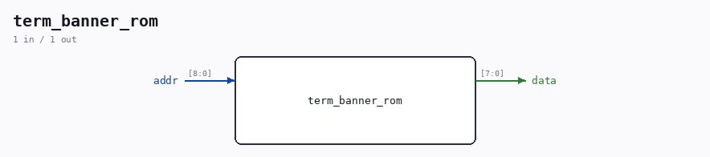
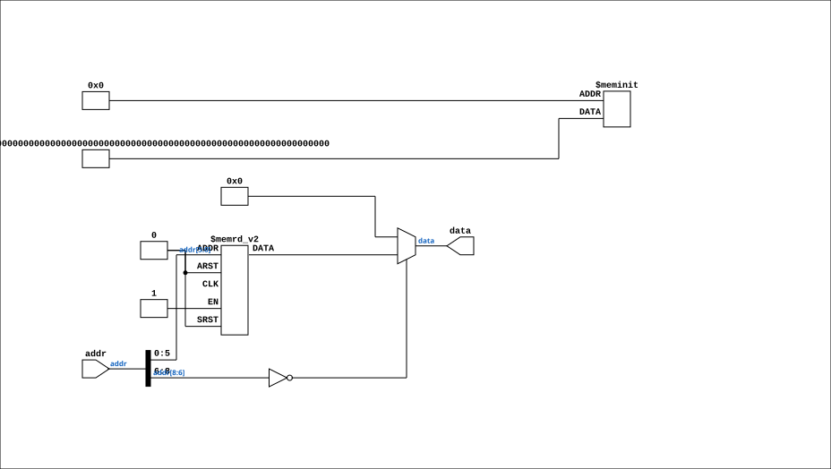

# term_banner_rom

Source: `Verilog/Terminals/rtl/term_banner_rom.v`

<!-- Generated by Verilog/tests/module_doc.py from the //! comments in the source. Do not edit by hand - edit the RTL comments and regenerate. -->

<!-- HIERARCHY-NAV:BEGIN - written by Verilog/tests/gen_hierarchy.py, do not edit -->

**Where it sits** (Nexys): [nd120_nexys4ddr_top](../../../fpga/nexys4ddr/doc/nd120_nexys4ddr_top.md) > [term_console_feed](term_console_feed.md) > [term_banner](term_banner.md) > **term_banner_rom**
- instance path: `FEED.BANNER.ROM`

**Used in:** [term_banner](term_banner.md) (Nexys, MEGA65 R6, MEGA65 R3)

**Contains:** no other modules.

[Module hierarchy](../../../HIERARCHY.md) - [All modules](../../../MODULES.md)

<!-- HIERARCHY-NAV:END -->



<!-- SCHEMATIC:BEGIN - written by Verilog/tests/gen_schematics.py, do not edit -->

## Schematic

Drawn from the Verilog: the yosys netlist of the Nexys 4 DDR build, instance `FEED.BANNER.ROM`. Sub-modules are boxes (click the picture to open it full size; there every sub-module box links to its page, and every wire shows its Verilog name).

[](term_banner_rom.svg)

<!-- SCHEMATIC:END -->

## Ports

| Direction | Width | Name | Description |
|---|---|---|---|
| input | `[8:0]` | `addr` |  |
| output | `[7:0]` | `data` |  |

## Verilog source

[`Verilog/Terminals/rtl/term_banner_rom.v`](https://github.com/RetroCoreLabs/nd-120/blob/main/Verilog/Terminals/rtl/term_banner_rom.v) on GitHub.

<details markdown="1">
<summary>Show the Verilog of term_banner_rom (80 lines)</summary>

```verilog
//============================================================================
//! Power-on message ROM for term_banner.v - GENERATED FILE, DO NOT EDIT.
//!
//! Regenerate with:  python3 font/make_banner.py   (from Verilog/Terminals/)
//! Edit the text in that script, not here.
//!
//! Part of the board-independent terminal core (Verilog/Terminals/).
//!
//! The message exists to split one failure into two. A blank screen and a
//! screen showing this text but not responding to the keyboard are completely
//! different faults, and telling them apart without this costs a build cycle -
//! which matters little on a board on the desk and a great deal when the board
//! belongs to someone in another country (see fpga/mega65/docs/00-plan.md).
//============================================================================

`default_nettype none

module term_banner_rom (
    input  wire [8:0] addr,
    output reg  [7:0] data
);

  //! Characters in the message, for the record only. term_banner.v does NOT
  //! use this - it stops at the first 0x00, which the default branch below
  //! returns for every address past the end. That is deliberate: a length
  //! constant is a second number that can disagree with the text.
  localparam integer LEN = 43;

  always @(*) begin
    case (addr)
      9'd0   : data = 8'h4E;  // N
      9'd1   : data = 8'h44;  // D
      9'd2   : data = 8'h2D;  // -
      9'd3   : data = 8'h31;  // 1
      9'd4   : data = 8'h32;  // 2
      9'd5   : data = 8'h30;  // 0
      9'd6   : data = 8'h2F;  // /
      9'd7   : data = 8'h43;  // C
      9'd8   : data = 8'h58;  // X
      9'd9   : data = 8'h20;  // space
      9'd10  : data = 8'h43;  // C
      9'd11  : data = 8'h50;  // P
      9'd12  : data = 8'h55;  // U
      9'd13  : data = 8'h20;  // space
      9'd14  : data = 8'h43;  // C
      9'd15  : data = 8'h4F;  // O
      9'd16  : data = 8'h52;  // R
      9'd17  : data = 8'h45;  // E
      9'd18  : data = 8'h0D;  // CR
      9'd19  : data = 8'h0A;  // LF
      9'd20  : data = 8'h38;  // 8
      9'd21  : data = 8'h30;  // 0
      9'd22  : data = 8'h78;  // x
      9'd23  : data = 8'h32;  // 2
      9'd24  : data = 8'h35;  // 5
      9'd25  : data = 8'h20;  // space
      9'd26  : data = 8'h54;  // T
      9'd27  : data = 8'h44;  // D
      9'd28  : data = 8'h56;  // V
      9'd29  : data = 8'h32;  // 2
      9'd30  : data = 8'h32;  // 2
      9'd31  : data = 8'h30;  // 0
      9'd32  : data = 8'h30;  // 0
      9'd33  : data = 8'h20;  // space
      9'd34  : data = 8'h63;  // c
      9'd35  : data = 8'h6F;  // o
      9'd36  : data = 8'h6E;  // n
      9'd37  : data = 8'h73;  // s
      9'd38  : data = 8'h6F;  // o
      9'd39  : data = 8'h6C;  // l
      9'd40  : data = 8'h65;  // e
      9'd41  : data = 8'h0D;  // CR
      9'd42  : data = 8'h0A;  // LF
      default: data = 8'h00;
    endcase
  end

endmodule

`default_nettype wire
```

</details>
