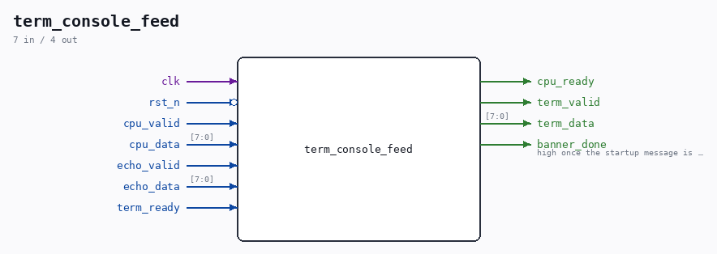

# term_console_feed

Source: `Verilog/Terminals/rtl/term_console_feed.v`

<!-- Generated by Verilog/tests/module_doc.py from the //! comments in the source. Do not edit by hand - edit the RTL comments and regenerate. -->

<!-- HIERARCHY-NAV:BEGIN - written by Verilog/tests/gen_hierarchy.py, do not edit -->

**Where it sits** (Nexys): [nd120_nexys4ddr_top](../../../fpga/nexys4ddr/doc/nd120_nexys4ddr_top.md) > **term_console_feed**
- instance path: `FEED`

**Used in:** [nd120_console_mega65](../../../fpga/mega65/rtl/doc/nd120_console_mega65.md) (MEGA65 R6, MEGA65 R3), [nd120_console_mister](../../../fpga/mister/rtl/doc/nd120_console_mister.md) (MiSTer), [nd120_nexys4ddr_top](../../../fpga/nexys4ddr/doc/nd120_nexys4ddr_top.md) (Nexys)

**Contains:** [term_banner](term_banner.md)

[Module hierarchy](../../../HIERARCHY.md) - [All modules](../../../MODULES.md)

<!-- HIERARCHY-NAV:END -->

## Ports

| Direction | Width | Name | Description |
|---|---|---|---|
| input | `1` | `clk` |  |
| input | `1` | `rst_n` *(active low)* |  |
| input | `1` | `cpu_valid` |  |
| input | `[7:0]` | `cpu_data` |  |
| output | `1` | `cpu_ready` |  |
| input | `1` | `echo_valid` |  |
| input | `[7:0]` | `echo_data` |  |
| output | `1` | `term_valid` |  |
| output | `[7:0]` | `term_data` |  |
| input | `1` | `term_ready` |  |
| output | `1` | `banner_done` | high once the startup message is on screen |
