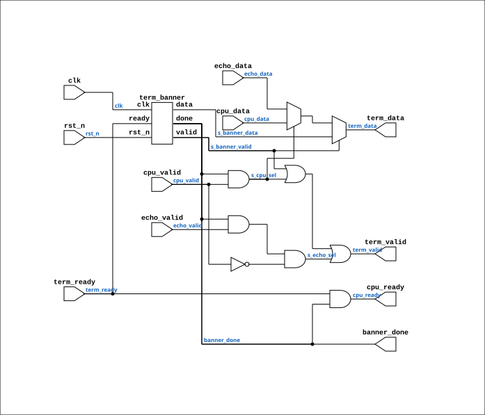

# term_console_feed

Source: `Verilog/Terminals/rtl/term_console_feed.v`

<!-- Generated by Verilog/tests/module_doc.py from the //! comments in the source. Do not edit by hand - edit the RTL comments and regenerate. -->

<!-- HIERARCHY-NAV:BEGIN - written by Verilog/tests/gen_hierarchy.py, do not edit -->

**Where it sits** (Nexys): [nd120_nexys4ddr_top](../../../fpga/nexys4ddr/doc/nd120_nexys4ddr_top.md) > **term_console_feed**
- instance path: `FEED`

**Used in:** [nd120_console_mega65](../../../fpga/mega65/rtl/doc/nd120_console_mega65.md) (MEGA65 R6, MEGA65 R3), [nd120_console_mister](../../../fpga/mister/rtl/doc/nd120_console_mister.md) (MiSTer), [nd120_nexys4ddr_top](../../../fpga/nexys4ddr/doc/nd120_nexys4ddr_top.md) (Nexys)

**Contains:** [term_banner](term_banner.md)

[Module hierarchy](../../../HIERARCHY.md) - [All modules](../../../MODULES.md)

<!-- HIERARCHY-NAV:END -->


<!-- SCHEMATIC:BEGIN - written by Verilog/tests/gen_schematics.py, do not edit -->

## Schematic

Drawn from the Verilog: the yosys netlist of the Nexys 4 DDR build, instance `FEED`. Sub-modules are boxes (click the picture to open it full size; there every sub-module box links to its page, and every wire shows its Verilog name).

[](term_console_feed.svg)

<!-- SCHEMATIC:END -->

## Ports

| Direction | Width | Name | Description |
|---|---|---|---|
| input | `1` | `clk` |  |
| input | `1` | `rst_n` *(active low)* |  |
| input | `1` | `cpu_valid` |  |
| input | `[7:0]` | `cpu_data` |  |
| output | `1` | `cpu_ready` |  |
| input | `1` | `echo_valid` | tied to 0 (in nd120_console_mega65 and others) |
| input | `[7:0]` | `echo_data` |  |
| output | `1` | `term_valid` |  |
| output | `[7:0]` | `term_data` |  |
| input | `1` | `term_ready` | low while the previous byte is in flight (from terminal_top.byte_ready) |
| output | `1` | `banner_done` | high once the startup message is on screen |

## Verilog source

[`Verilog/Terminals/rtl/term_console_feed.v`](https://github.com/RetroCoreLabs/nd-120/blob/main/Verilog/Terminals/rtl/term_console_feed.v) on GitHub.

<details markdown="1">
<summary>Show the Verilog of term_console_feed (86 lines)</summary>

```verilog
//============================================================================
//! Everything that decides WHICH byte the terminal displays next.
//!
//! Part of the board-independent terminal core (Verilog/Terminals/).
//!
//! Contains the power-on banner and the priority between the three possible
//! sources. Drop this between a board's byte sources and terminal_top and the
//! board has a self-testing console.
//!
//! WHY THIS IS A MODULE AND NOT TEN LINES IN EACH BOARD'S TOP LEVEL. It was
//! ten lines in the MiSTer glue first, and one of them was wrong in a way that
//! took a testbench to find (the s_banner_done gating below). Every board
//! needs the same ten lines. Copying logic that has already been got wrong
//! once, into two more places, is how a fixed bug comes back.
//!
//! PRIORITY, strictly:
//!   1. the banner - owns the screen until it has finished, then never speaks
//!      again. If it had to share, a machine that starts talking immediately
//!      would interleave with it and the self-test message would be unreadable
//!      exactly when something is wrong.
//!   2. the machine
//!   3. local echo, for boards with no machine attached yet
//!
//! Written 28-AUG-2026.
//============================================================================

`default_nettype none

module term_console_feed (
    input wire clk,
    input wire rst_n,

    //! From the machine's console output.
    input  wire       cpu_valid,
    input  wire [7:0] cpu_data,
    output wire       cpu_ready,

    //! Local echo, for a board with nothing behind the seam yet. A board that
    //! has a machine ties this off - the machine echoes, and a terminal that
    //! echoes as well shows every character twice.
    input  wire       echo_valid,  //! tied to 0 (in nd120_console_mega65 and others)
    input  wire [7:0] echo_data,

    //! To terminal_top's byte port.
    output wire       term_valid,
    output wire [7:0] term_data,
    input  wire       term_ready,  //! low while the previous byte is in flight (from terminal_top.byte_ready)

    output wire banner_done  //! high once the startup message is on screen
);

  wire       s_banner_valid;
  wire [7:0] s_banner_data;

  term_banner BANNER (
      .clk  (clk),
      .rst_n(rst_n),
      .valid(s_banner_valid),
      .data (s_banner_data),
      .ready(term_ready),
      .done (banner_done)
  );

  //! Gated on banner_done, and that is NOT the same as gating on
  //! !s_banner_valid. There is exactly one clock where the banner has reached
  //! its terminator so `valid` has already fallen but `done` has not yet
  //! risen. Selecting on !valid would let a machine byte through in that cycle
  //! while cpu_ready (which follows `done`) was still low - so the terminal
  //! would print the byte and the machine, never seeing it accepted, would
  //! send it again. One duplicated character at the top of every boot, and a
  //! miserable thing to chase on hardware.
  wire s_cpu_sel  = banner_done && cpu_valid;
  wire s_echo_sel = banner_done && echo_valid && !cpu_valid;

  assign term_valid = s_banner_valid || s_cpu_sel || s_echo_sel;
  assign term_data  = s_banner_valid ? s_banner_data :
                      (s_cpu_sel ? cpu_data : echo_data);

  //! The machine is only told the terminal is ready once the banner is out of
  //! the way, so a byte arriving during the banner is refused rather than
  //! silently dropped.
  assign cpu_ready = term_ready && banner_done;

endmodule

`default_nettype wire
```

</details>
