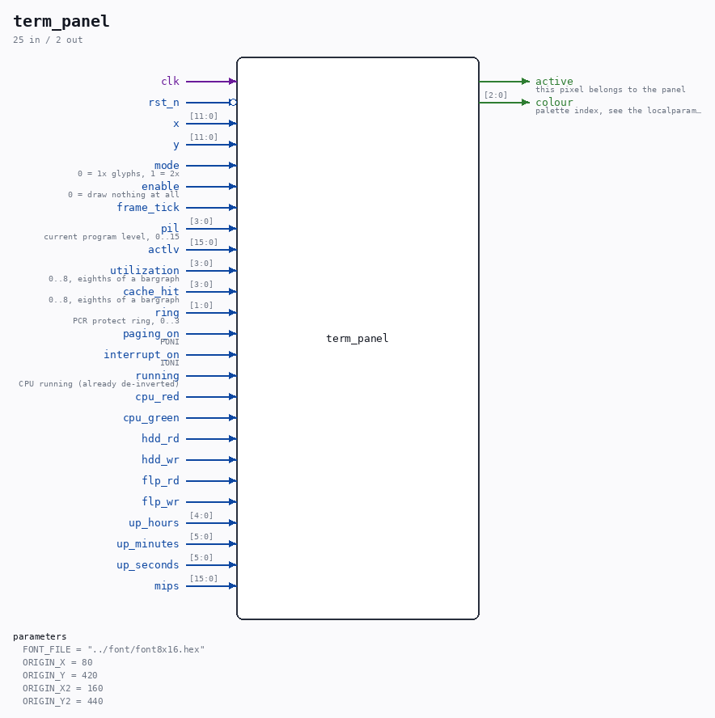

# term_panel

Source: `Verilog/Terminals/rtl/term_panel.v`

> Generated by `Verilog/tests/module_doc.py` from the `//!`
> comments in the source. Do not edit by hand - edit the RTL comments and regenerate.

## Parameters

| Parameter | Default |
|---|---|
| `FONT_FILE` | `"../font/font8x16.hex"` |
| `ORIGIN_X` | `80` |
| `ORIGIN_Y` | `420` |
| `ORIGIN_X2` | `160` |
| `ORIGIN_Y2` | `440` |

## Ports

| Direction | Width | Name | Description |
|---|---|---|---|
| input | `1` | `clk` |  |
| input | `1` | `rst_n` *(active low)* |  |
| input | `[11:0]` | `x` |  |
| input | `[11:0]` | `y` |  |
| input | `1` | `mode` | 0 = 1x glyphs, 1 = 2x |
| input | `1` | `enable` | 0 = draw nothing at all |
| input | `1` | `frame_tick` |  |
| input | `[3:0]` | `pil` | current program level, 0..15 |
| input | `[15:0]` | `actlv` |  |
| input | `[3:0]` | `utilization` | 0..8, eighths of a bargraph |
| input | `[3:0]` | `cache_hit` | 0..8, eighths of a bargraph |
| input | `[1:0]` | `ring` | PCR protect ring, 0..3 |
| input | `1` | `paging_on` | PONI |
| input | `1` | `interrupt_on` | IONI |
| input | `1` | `running` | CPU running (already de-inverted) |
| input | `1` | `cpu_red` |  |
| input | `1` | `cpu_green` |  |
| input | `1` | `hdd_rd` |  |
| input | `1` | `hdd_wr` |  |
| input | `1` | `flp_rd` |  |
| input | `1` | `flp_wr` |  |
| input | `[4:0]` | `up_hours` |  |
| input | `[5:0]` | `up_minutes` |  |
| input | `[5:0]` | `up_seconds` |  |
| input | `[15:0]` | `mips` |  |
| output | `1` | `active` | this pixel belongs to the panel |
| output | `[2:0]` | `colour` | palette index, see the localparams below |
