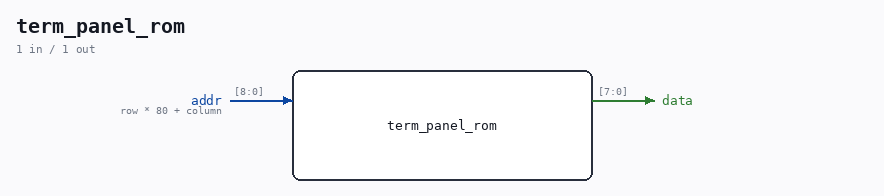

# term_panel_rom

Source: `Verilog/Terminals/rtl/term_panel_rom.v`

> Generated by `Verilog/tests/module_doc.py` from the `//!`
> comments in the source. Do not edit by hand - edit the RTL comments and regenerate.

## Ports

| Direction | Width | Name | Description |
|---|---|---|---|
| input | `[8:0]` | `addr` | row * 80 + column |
| output | `[7:0]` | `data` |  |
