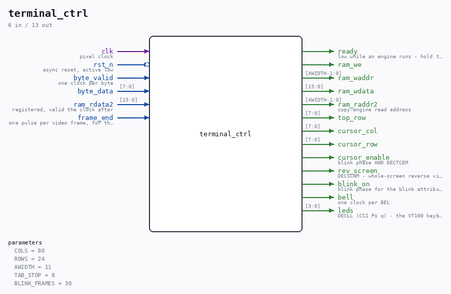

# terminal_ctrl

Source: `Verilog/Terminals/rtl/terminal_ctrl.v`

<!-- Generated by Verilog/tests/module_doc.py from the //! comments in the source. Do not edit by hand - edit the RTL comments and regenerate. -->

<!-- HIERARCHY-NAV:BEGIN - written by Verilog/tests/gen_hierarchy.py, do not edit -->

**Hierarchy:** not instantiated by any of the 9 build tops (elaborated by yosys).

[Module hierarchy](../../../HIERARCHY.md) - [All modules](../../../MODULES.md)

<!-- HIERARCHY-NAV:END -->

## Parameters

| Parameter | Default |
|---|---|
| `COLS` | `80` |
| `ROWS` | `24` |
| `AWIDTH` | `11` |
| `TAB_STOP` | `8` |
| `BLINK_FRAMES` | `30` |

## Ports

| Direction | Width | Name | Description |
|---|---|---|---|
| input | `1` | `clk` | pixel clock |
| input | `1` | `rst_n` *(active low)* | async reset, active low |
| input | `1` | `byte_valid` | one clock per byte |
| input | `[7:0]` | `byte_data` |  |
| output | `1` | `ready` | low while an engine runs - hold the source |
| output | `1` | `ram_we` |  |
| output | `[AWIDTH-1:0]` | `ram_waddr` |  |
| output | `[15:0]` | `ram_wdata` |  |
| output | `[AWIDTH-1:0]` | `ram_raddr2` | copy-engine read address |
| input | `[15:0]` | `ram_rdata2` | registered, valid the clock after |
| output | `[7:0]` | `top_row` |  |
| output | `[7:0]` | `cursor_col` |  |
| output | `[7:0]` | `cursor_row` |  |
| output | `1` | `cursor_enable` | blink phase AND DECTCEM |
| output | `1` | `rev_screen` | DECSCNM - whole-screen reverse video |
| output | `1` | `blink_on` | blink phase for the blink attribute |
| input | `1` | `frame_end` | one pulse per video frame, for the blink |
| output | `1` | `bell` | one clock per BEL |
| output | `[3:0]` | `leds` | DECLL (CSI Ps q) - the VT100 keyboard lamps L1-L4 |
