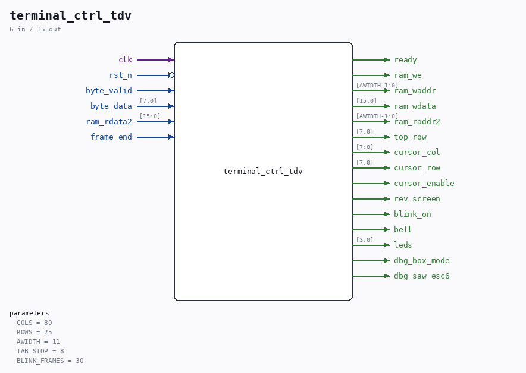

# terminal_ctrl_tdv

Source: `Verilog/Terminals/rtl/terminal_ctrl_tdv.v`

<!-- Generated by Verilog/tests/module_doc.py from the //! comments in the source. Do not edit by hand - edit the RTL comments and regenerate. -->

<!-- HIERARCHY-NAV:BEGIN - written by Verilog/tests/gen_hierarchy.py, do not edit -->

**Where it sits** (Nexys): [nd120_nexys4ddr_top](../../../fpga/nexys4ddr/doc/nd120_nexys4ddr_top.md) > [terminal_top](terminal_top.md) > **terminal_ctrl_tdv**
- instance path: `TERMINAL.CTRL`

**Used in:** [terminal_top](terminal_top.md) (Nexys, MiSTer, MEGA65 R6, MEGA65 R3)

**Contains:** no other modules.

[Module hierarchy](../../../HIERARCHY.md) - [All modules](../../../MODULES.md)

<!-- HIERARCHY-NAV:END -->

## Parameters

| Parameter | Default |
|---|---|
| `COLS` | `80` |
| `ROWS` | `25` |
| `AWIDTH` | `11` |
| `TAB_STOP` | `8` |
| `BLINK_FRAMES` | `30` |

## Ports

| Direction | Width | Name | Description |
|---|---|---|---|
| input | `1` | `clk` |  |
| input | `1` | `rst_n` *(active low)* |  |
| input | `1` | `byte_valid` |  |
| input | `[7:0]` | `byte_data` |  |
| output | `1` | `ready` |  |
| output | `1` | `ram_we` |  |
| output | `[AWIDTH-1:0]` | `ram_waddr` |  |
| output | `[15:0]` | `ram_wdata` |  |
| output | `[AWIDTH-1:0]` | `ram_raddr2` |  |
| input | `[15:0]` | `ram_rdata2` |  |
| output | `[7:0]` | `top_row` |  |
| output | `[7:0]` | `cursor_col` |  |
| output | `[7:0]` | `cursor_row` |  |
| output | `1` | `cursor_enable` |  |
| output | `1` | `rev_screen` |  |
| output | `1` | `blink_on` |  |
| input | `1` | `frame_end` |  |
| output | `1` | `bell` |  |
| output | `[3:0]` | `leds` |  |
| output | `1` | `dbg_box_mode` |  |
| output | `1` | `dbg_saw_esc6` |  |
