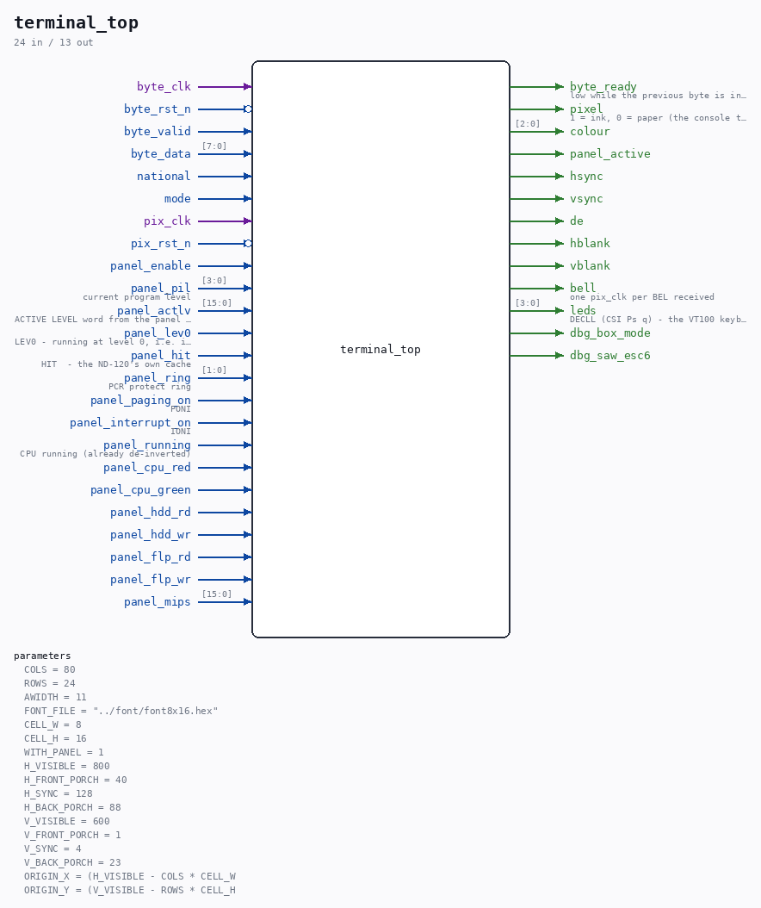

# terminal_top

Source: `Verilog/Terminals/rtl/terminal_top.v`

> Generated by `Verilog/tests/module_doc.py` from the `//!`
> comments in the source. Do not edit by hand - edit the RTL comments and regenerate.

<!-- HIERARCHY-NAV:BEGIN - written by Verilog/tests/gen_hierarchy.py, do not edit -->

**Where it sits** (Nexys): [nd120_nexys4ddr_top](../../../fpga/nexys4ddr/doc/nd120_nexys4ddr_top.md) > **terminal_top**
- instance path: `TERMINAL`

**Used in:** [nd120_console_mega65](../../../fpga/mega65/rtl/doc/nd120_console_mega65.md) (MEGA65 R6, MEGA65 R3), [nd120_console_mister](../../../fpga/mister/rtl/doc/nd120_console_mister.md) (MiSTer), [nd120_nexys4ddr_top](../../../fpga/nexys4ddr/doc/nd120_nexys4ddr_top.md) (Nexys)

**Contains:** [byte_fifo](byte_fifo.md), [cdc_byte](cdc_byte.md), [char_ram](char_ram.md), [rate_meter](rate_meter.md) x2, [term_panel](term_panel.md), [terminal_ctrl_tdv](terminal_ctrl_tdv.md), [text_screen](text_screen.md)

[Module hierarchy](../../../HIERARCHY.md) - [All modules](../../../MODULES.md)

<!-- HIERARCHY-NAV:END -->

## Parameters

| Parameter | Default |
|---|---|
| `COLS` | `80` |
| `ROWS` | `24` |
| `AWIDTH` | `11` |
| `FONT_FILE` | `"../font/font8x16.hex"` |
| `CELL_W` | `8` |
| `CELL_H` | `16` |
| `WITH_PANEL` | `1` |
| `H_VISIBLE` | `800` |
| `H_FRONT_PORCH` | `40` |
| `H_SYNC` | `128` |
| `H_BACK_PORCH` | `88` |
| `V_VISIBLE` | `600` |
| `V_FRONT_PORCH` | `1` |
| `V_SYNC` | `4` |
| `V_BACK_PORCH` | `23` |
| `ORIGIN_X` | `(H_VISIBLE - COLS * CELL_W` |
| `ORIGIN_Y` | `(V_VISIBLE - ROWS * CELL_H` |

## Ports

| Direction | Width | Name | Description |
|---|---|---|---|
| input | `1` | `byte_clk` |  |
| input | `1` | `byte_rst_n` *(active low)* |  |
| input | `1` | `byte_valid` |  |
| input | `[7:0]` | `byte_data` |  |
| output | `1` | `byte_ready` | low while the previous byte is in flight |
| input | `1` | `national` |  |
| input | `1` | `mode` |  |
| input | `1` | `pix_clk` |  |
| input | `1` | `pix_rst_n` *(active low)* |  |
| output | `1` | `pixel` | 1 = ink, 0 = paper (the console text alone) |
| output | `[2:0]` | `colour` |  |
| output | `1` | `panel_active` |  |
| output | `1` | `hsync` |  |
| output | `1` | `vsync` |  |
| output | `1` | `de` |  |
| output | `1` | `hblank` |  |
| output | `1` | `vblank` |  |
| input | `1` | `panel_enable` |  |
| input | `[3:0]` | `panel_pil` | current program level |
| input | `[15:0]` | `panel_actlv` | ACTIVE LEVEL word from the panel processor (0 = none yet) |
| input | `1` | `panel_lev0` | LEV0 - running at level 0, i.e. idle |
| input | `1` | `panel_hit` | HIT  - the ND-120's own cache |
| input | `[1:0]` | `panel_ring` | PCR protect ring |
| input | `1` | `panel_paging_on` | PONI |
| input | `1` | `panel_interrupt_on` | IONI |
| input | `1` | `panel_running` | CPU running (already de-inverted) |
| input | `1` | `panel_cpu_red` |  |
| input | `1` | `panel_cpu_green` |  |
| input | `1` | `panel_hdd_rd` |  |
| input | `1` | `panel_hdd_wr` |  |
| input | `1` | `panel_flp_rd` |  |
| input | `1` | `panel_flp_wr` |  |
| input | `[15:0]` | `panel_mips` |  |
| output | `1` | `bell` | one pix_clk per BEL received |
| output | `[3:0]` | `leds` | DECLL (CSI Ps q) - the VT100 keyboard lamps L1-L4 |
| output | `1` | `dbg_box_mode` |  |
| output | `1` | `dbg_saw_esc6` |  |
