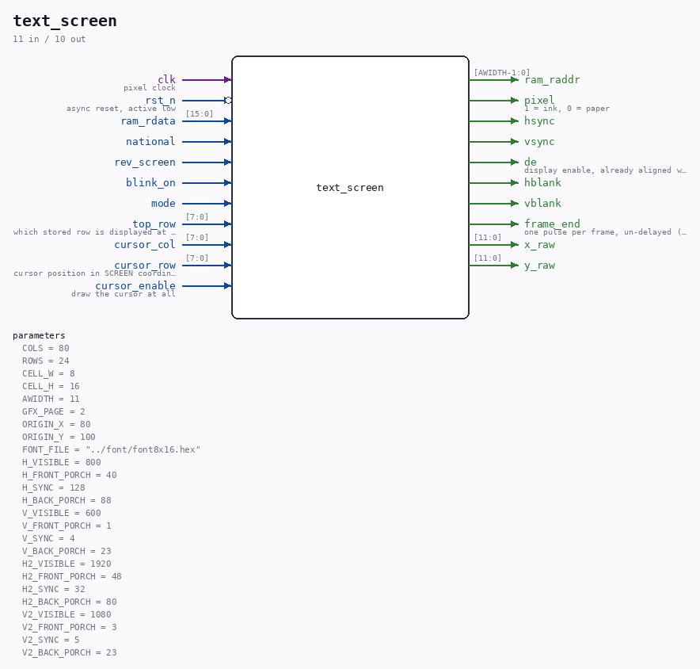

# text_screen

Source: `Verilog/Terminals/rtl/text_screen.v`

> Generated by `Verilog/tests/module_doc.py` from the `//!`
> comments in the source. Do not edit by hand - edit the RTL comments and regenerate.

<!-- HIERARCHY-NAV:BEGIN - written by Verilog/tests/gen_hierarchy.py, do not edit -->

**Where it sits** (Nexys): [nd120_nexys4ddr_top](../../../fpga/nexys4ddr/doc/nd120_nexys4ddr_top.md) > [terminal_top](terminal_top.md) > **text_screen**
- instance path: `TERMINAL.SCREEN`

**Used in:** [terminal_top](terminal_top.md) (Nexys, MiSTer, MEGA65 R6, MEGA65 R3)

**Contains:** [font_rom](font_rom.md), [vga_timing](vga_timing.md)

[Module hierarchy](../../../HIERARCHY.md) - [All modules](../../../MODULES.md)

<!-- HIERARCHY-NAV:END -->

## Parameters

| Parameter | Default |
|---|---|
| `COLS` | `80` |
| `ROWS` | `24` |
| `CELL_W` | `8` |
| `CELL_H` | `16` |
| `AWIDTH` | `11` |
| `GFX_PAGE` | `2` |
| `ORIGIN_X` | `80` |
| `ORIGIN_Y` | `100` |
| `FONT_FILE` | `"../font/font8x16.hex"` |
| `H_VISIBLE` | `800` |
| `H_FRONT_PORCH` | `40` |
| `H_SYNC` | `128` |
| `H_BACK_PORCH` | `88` |
| `V_VISIBLE` | `600` |
| `V_FRONT_PORCH` | `1` |
| `V_SYNC` | `4` |
| `V_BACK_PORCH` | `23` |
| `H2_VISIBLE` | `1920` |
| `H2_FRONT_PORCH` | `48` |
| `H2_SYNC` | `32` |
| `H2_BACK_PORCH` | `80` |
| `V2_VISIBLE` | `1080` |
| `V2_FRONT_PORCH` | `3` |
| `V2_SYNC` | `5` |
| `V2_BACK_PORCH` | `23` |

## Ports

| Direction | Width | Name | Description |
|---|---|---|---|
| input | `1` | `clk` | pixel clock |
| input | `1` | `rst_n` *(active low)* | async reset, active low |
| output | `[AWIDTH-1:0]` | `ram_raddr` |  |
| input | `[15:0]` | `ram_rdata` |  |
| input | `1` | `national` |  |
| input | `1` | `rev_screen` |  |
| input | `1` | `blink_on` |  |
| input | `1` | `mode` |  |
| input | `[7:0]` | `top_row` | which stored row is displayed at the top |
| input | `[7:0]` | `cursor_col` |  |
| input | `[7:0]` | `cursor_row` | cursor position in SCREEN coordinates |
| input | `1` | `cursor_enable` | draw the cursor at all |
| output | `1` | `pixel` | 1 = ink, 0 = paper |
| output | `1` | `hsync` |  |
| output | `1` | `vsync` |  |
| output | `1` | `de` | display enable, already aligned with `pixel` |
| output | `1` | `hblank` |  |
| output | `1` | `vblank` |  |
| output | `1` | `frame_end` | one pulse per frame, un-delayed (for blink) |
| output | `[11:0]` | `x_raw` |  |
| output | `[11:0]` | `y_raw` |  |
