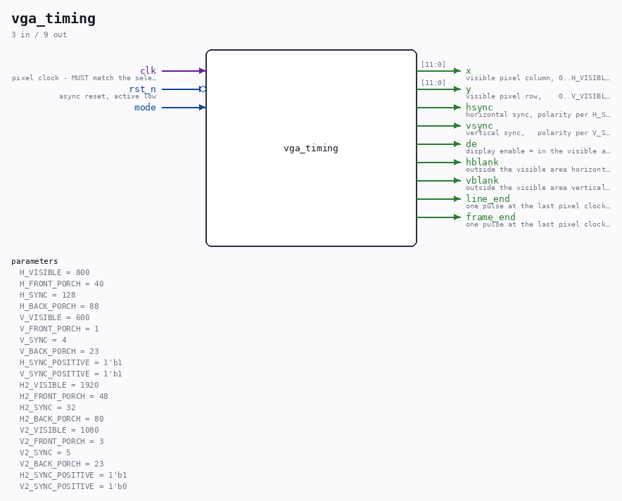

# vga_timing

Source: `Verilog/Terminals/rtl/vga_timing.v`

> Generated by `Verilog/tests/module_doc.py` from the `//!`
> comments in the source. Do not edit by hand - edit the RTL comments and regenerate.

## Parameters

| Parameter | Default |
|---|---|
| `H_VISIBLE` | `800` |
| `H_FRONT_PORCH` | `40` |
| `H_SYNC` | `128` |
| `H_BACK_PORCH` | `88` |
| `V_VISIBLE` | `600` |
| `V_FRONT_PORCH` | `1` |
| `V_SYNC` | `4` |
| `V_BACK_PORCH` | `23` |
| `H_SYNC_POSITIVE` | `1'b1` |
| `V_SYNC_POSITIVE` | `1'b1` |
| `H2_VISIBLE` | `1920` |
| `H2_FRONT_PORCH` | `48` |
| `H2_SYNC` | `32` |
| `H2_BACK_PORCH` | `80` |
| `V2_VISIBLE` | `1080` |
| `V2_FRONT_PORCH` | `3` |
| `V2_SYNC` | `5` |
| `V2_BACK_PORCH` | `23` |
| `H2_SYNC_POSITIVE` | `1'b1` |
| `V2_SYNC_POSITIVE` | `1'b0` |

## Ports

| Direction | Width | Name | Description |
|---|---|---|---|
| input | `1` | `clk` | pixel clock - MUST match the selected mode |
| input | `1` | `rst_n` *(active low)* | async reset, active low |
| input | `1` | `mode` |  |
| output | `[11:0]` | `x` | visible pixel column, 0..H_VISIBLE-1 (only valid while de) |
| output | `[11:0]` | `y` | visible pixel row,    0..V_VISIBLE-1 (only valid while de) |
| output | `1` | `hsync` | horizontal sync, polarity per H_SYNC_POSITIVE |
| output | `1` | `vsync` | vertical sync,   polarity per V_SYNC_POSITIVE |
| output | `1` | `de` | display enable = in the visible area (~(hblank|vblank)) |
| output | `1` | `hblank` | outside the visible area horizontally |
| output | `1` | `vblank` | outside the visible area vertically |
| output | `1` | `line_end` | one pulse at the last pixel clock of every line |
| output | `1` | `frame_end` | one pulse at the last pixel clock of every frame |
