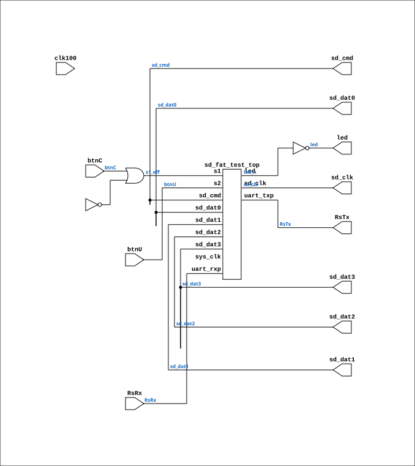

# basys3_sd_fat_top

Source: `Verilog/fpga/basys3/sd-fat-test/basys3_sd_fat_top.v`

<!-- Generated by Verilog/tests/module_doc.py from the //! comments in the source. Do not edit by hand - edit the RTL comments and regenerate. -->

<!-- HIERARCHY-NAV:BEGIN - written by Verilog/tests/gen_hierarchy.py, do not edit -->

**Hierarchy:** not instantiated by any of the 9 build tops (elaborated by yosys).

[Module hierarchy](../../../../HIERARCHY.md) - [All modules](../../../../MODULES.md)

<!-- HIERARCHY-NAV:END -->


<!-- SCHEMATIC:BEGIN - written by Verilog/tests/gen_schematics.py, do not edit -->

## Schematic

Drawn from the Verilog: no build top uses this module, so it was elaborated from its own file with no defines and default parameters. Sub-modules are boxes (click the picture to open it full size; there every sub-module box links to its page, and every wire shows its Verilog name).

[](basys3_sd_fat_top.svg)

<!-- SCHEMATIC:END -->

## Description

Basys3 wrapper for the SD-FAT test (sd_fat_test_top)
The test design itself is board-independent (single clock domain, all
SD/UART speeds derived from CLK_FREQ by enable dividers). This wrapper
only provides:
- a 27.027 MHz clock from the Basys3 100 MHz crystal (MMCM, x10/37),
so every divider/watchdog parameter stays identical to the
hardware-proven Tang Nano 20K build (CLK_FREQ passed exactly),
- button mapping: btnC (center) = S1 full reset, btnU (up) = S2;
reset is also held while the MMCM is unlocked,
- LED polarity: the test drives active-LOW (Tang convention),
Basys3 LEDs are active-HIGH -> inverted here (LD0-LD5),
- UART to the FT2232 (RsRx/RsTx), 9600 8N1,
- SD signals straight through to Pmod JB (top-right connector),
Digilent Pmod MicroSD pinout (see basys3_sd_fat.xdc).
Build: vivado -mode batch -source build.tcl   (see README.md)
Last reviewed: 13-JUL-2026
Ronny Hansen

## Ports

| Direction | Width | Name | Description |
|---|---|---|---|
| input | `1` | `clk100` | W5, 100 MHz crystal |
| input | `1` | `btnC` | U18, center button = S1 (full reset), active high |
| input | `1` | `btnU` | T18, up button     = S2 (same function), active high |
| input | `1` | `RsRx` | B18, from PC (FT2232 UART) |
| output | `1` | `RsTx` | A18, to PC |
| output | `1` | `sd_clk` | JB4  (Pmod pin 4, SCK) |
| inout | `1` | `sd_cmd` | JB2  (Pmod pin 2, MOSI/CMD) |
| inout | `1` | `sd_dat0` | JB3  (Pmod pin 3, MISO/DAT0) |
| inout | `1` | `sd_dat1` | JB7  (Pmod pin 7, DAT1) |
| inout | `1` | `sd_dat2` | JB8  (Pmod pin 8, DAT2) |
| inout | `1` | `sd_dat3` | JB1  (Pmod pin 1, ~CS/DAT3) |
| output | `[5:0]` | `led` | LD0-LD5, active high |

## Verilog source

[`Verilog/fpga/basys3/sd-fat-test/basys3_sd_fat_top.v`](https://github.com/RetroCoreLabs/nd-120/blob/main/Verilog/fpga/basys3/sd-fat-test/basys3_sd_fat_top.v) on GitHub.

<details markdown="1">
<summary>Show the Verilog of basys3_sd_fat_top (93 lines)</summary>

```verilog
/****************************************************************************
** Basys3 wrapper for the SD-FAT test (sd_fat_test_top)                    **
**                                                                         **
** The test design itself is board-independent (single clock domain, all  **
** SD/UART speeds derived from CLK_FREQ by enable dividers). This wrapper **
** only provides:                                                          **
**   - a 27.027 MHz clock from the Basys3 100 MHz crystal (MMCM, x10/37), **
**     so every divider/watchdog parameter stays identical to the         **
**     hardware-proven Tang Nano 20K build (CLK_FREQ passed exactly),     **
**   - button mapping: btnC (center) = S1 full reset, btnU (up) = S2;     **
**     reset is also held while the MMCM is unlocked,                     **
**   - LED polarity: the test drives active-LOW (Tang convention),        **
**     Basys3 LEDs are active-HIGH -> inverted here (LD0-LD5),            **
**   - UART to the FT2232 (RsRx/RsTx), 9600 8N1,                          **
**   - SD signals straight through to Pmod JB (top-right connector),      **
**     Digilent Pmod MicroSD pinout (see basys3_sd_fat.xdc).              **
**                                                                         **
** Build: vivado -mode batch -source build.tcl   (see README.md)          **
**                                                                         **
** Last reviewed: 13-JUL-2026                                              **
** Ronny Hansen                                                            **
*****************************************************************************/

module basys3_sd_fat_top (
    input clk100,  // W5, 100 MHz crystal
    input btnC,    // U18, center button = S1 (full reset), active high
    input btnU,    // T18, up button     = S2 (same function), active high

    input  RsRx,  // B18, from PC (FT2232 UART)
    output RsTx,  // A18, to PC

    // Pmod JB, Digilent Pmod MicroSD / Pmod SD pin mapping
    output sd_clk,   // JB4  (Pmod pin 4, SCK)
    inout  sd_cmd,   // JB2  (Pmod pin 2, MOSI/CMD)
    inout  sd_dat0,  // JB3  (Pmod pin 3, MISO/DAT0)
    inout  sd_dat1,  // JB7  (Pmod pin 7, DAT1)
    inout  sd_dat2,  // JB8  (Pmod pin 8, DAT2)
    inout  sd_dat3,  // JB1  (Pmod pin 1, ~CS/DAT3)

    output [5:0] led  // LD0-LD5, active high
);

  /**********************************************
  *  27.027 MHz from 100 MHz (VCO 1000/37)      *
  ***********************************************/
  wire clk27_pre, clkfb_out, clkfb_in, mmcm_locked;
  wire clk27;

  MMCME2_BASE #(
      .BANDWIDTH       ("OPTIMIZED"),
      .CLKFBOUT_MULT_F (10.0),  // VCO = 100 * 10 = 1000 MHz
      .CLKIN1_PERIOD   (10.0),  // 100 MHz input
      .CLKOUT0_DIVIDE_F(37.0),  // 1000 / 37 = 27.027 MHz
      .DIVCLK_DIVIDE   (1),
      .STARTUP_WAIT    ("FALSE")
  ) mmcm_sd_clk (
      .CLKIN1  (clk100),
      .CLKFBIN (clkfb_in),
      .CLKFBOUT(clkfb_out),
      .CLKOUT0 (clk27_pre),
      .LOCKED  (mmcm_locked),
      .PWRDWN  (1'b0),
      .RST     (1'b0)
  );
  BUFG bufg_fb (.I(clkfb_out), .O(clkfb_in));
  BUFG bufg_27 (.I(clk27_pre), .O(clk27));

  // Hold the test in reset until the MMCM locks (s1 is the full-reset input)
  wire s1_eff = btnC | ~mmcm_locked;

  wire [5:0] led_n;  // active low from the test design
  assign led = ~led_n;

  sd_fat_test_top #(
      .CLK_FREQ(27_027_027)  // exact MMCM output; all dividers derive from it
  ) u_test (
      .sys_clk (clk27),
      .s1      (s1_eff),
      .s2      (btnU),
      .uart_rxp(RsRx),
      .uart_txp(RsTx),

      .sd_clk (sd_clk),
      .sd_cmd (sd_cmd),
      .sd_dat0(sd_dat0),
      .sd_dat1(sd_dat1),
      .sd_dat2(sd_dat2),
      .sd_dat3(sd_dat3),

      .led(led_n)
  );

endmodule
```

</details>
