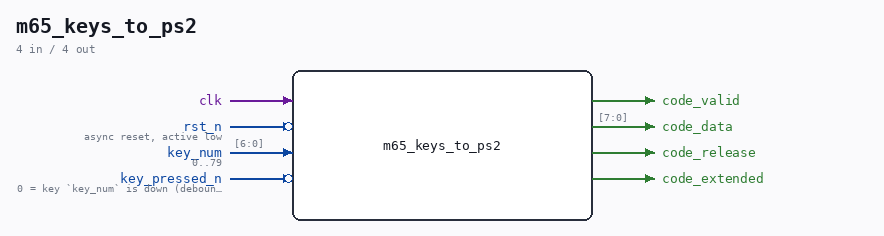

# m65_keys_to_ps2

Source: `Verilog/fpga/mega65/rtl/m65_keys_to_ps2.v`

<!-- Generated by Verilog/tests/module_doc.py from the //! comments in the source. Do not edit by hand - edit the RTL comments and regenerate. -->

<!-- HIERARCHY-NAV:BEGIN - written by Verilog/tests/gen_hierarchy.py, do not edit -->

**Where it sits** (MEGA65 R6): [nd120_mega65_machine](nd120_mega65_machine.md) > [nd120_console_mega65](nd120_console_mega65.md) > **m65_keys_to_ps2**
- instance path: `CONSOLE.KEYS`

**Used in:** [nd120_console_mega65](nd120_console_mega65.md) (MEGA65 R6, MEGA65 R3)

**Contains:** no other modules.

[Module hierarchy](../../../../HIERARCHY.md) - [All modules](../../../../MODULES.md)

<!-- HIERARCHY-NAV:END -->

## Ports

| Direction | Width | Name | Description |
|---|---|---|---|
| input | `1` | `clk` |  |
| input | `1` | `rst_n` *(active low)* | async reset, active low |
| input | `[6:0]` | `key_num` | 0..79 |
| input | `1` | `key_pressed_n` *(active low)* | 0 = key `key_num` is down (debounced) |
| output | `1` | `code_valid` |  |
| output | `[7:0]` | `code_data` |  |
| output | `1` | `code_release` |  |
| output | `1` | `code_extended` |  |
