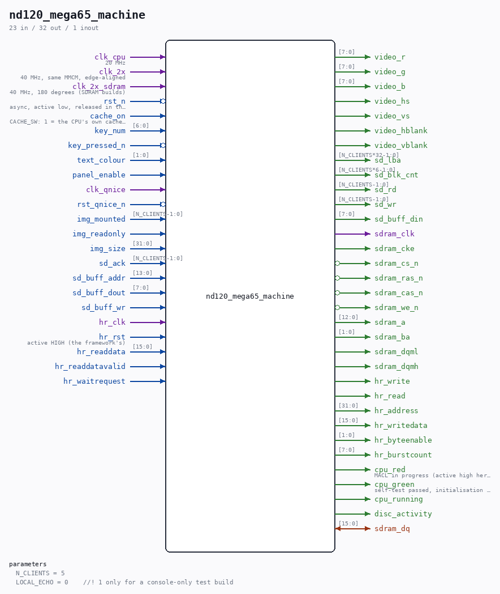

# nd120_mega65_machine

Source: `Verilog/fpga/mega65/rtl/nd120_mega65_machine.v`

> Generated by `Verilog/tests/module_doc.py` from the `//!`
> comments in the source. Do not edit by hand - edit the RTL comments and regenerate.

## Parameters

| Parameter | Default |
|---|---|
| `N_CLIENTS` | `5` |
| `LOCAL_ECHO` | `0    //! 1 only for a console-only test build` |

## Ports

| Direction | Width | Name | Description |
|---|---|---|---|
| input | `1` | `clk_cpu` | 20 MHz |
| input | `1` | `clk_2x` | 40 MHz, same MMCM, edge-aligned |
| input | `1` | `clk_2x_sdram` | 40 MHz, 180 degrees (SDRAM builds) |
| input | `1` | `rst_n` *(active low)* | async, active low, released in the clk_2x domain |
| input | `1` | `cache_on` | CACHE_SW: 1 = the CPU's own cache enabled |
| input | `[6:0]` | `key_num` |  |
| input | `1` | `key_pressed_n` *(active low)* |  |
| input | `[1:0]` | `text_colour` |  |
| input | `1` | `panel_enable` |  |
| output | `[7:0]` | `video_r` |  |
| output | `[7:0]` | `video_g` |  |
| output | `[7:0]` | `video_b` |  |
| output | `1` | `video_hs` |  |
| output | `1` | `video_vs` |  |
| output | `1` | `video_hblank` |  |
| output | `1` | `video_vblank` |  |
| input | `1` | `clk_qnice` |  |
| input | `1` | `rst_qnice_n` *(active low)* |  |
| input | `[N_CLIENTS-1:0]` | `img_mounted` |  |
| input | `1` | `img_readonly` |  |
| input | `[31:0]` | `img_size` |  |
| output | `[N_CLIENTS*32-1:0]` | `sd_lba` |  |
| output | `[N_CLIENTS*6-1:0]` | `sd_blk_cnt` |  |
| output | `[N_CLIENTS-1:0]` | `sd_rd` |  |
| output | `[N_CLIENTS-1:0]` | `sd_wr` |  |
| input | `[N_CLIENTS-1:0]` | `sd_ack` |  |
| input | `[13:0]` | `sd_buff_addr` |  |
| input | `[7:0]` | `sd_buff_dout` |  |
| output | `[7:0]` | `sd_buff_din` |  |
| input | `1` | `sd_buff_wr` |  |
| output | `1` | `sdram_clk` |  |
| output | `1` | `sdram_cke` |  |
| output | `1` | `sdram_cs_n` *(active low)* |  |
| output | `1` | `sdram_ras_n` *(active low)* |  |
| output | `1` | `sdram_cas_n` *(active low)* |  |
| output | `1` | `sdram_we_n` *(active low)* |  |
| output | `[12:0]` | `sdram_a` |  |
| output | `[1:0]` | `sdram_ba` |  |
| output | `1` | `sdram_dqml` |  |
| output | `1` | `sdram_dqmh` |  |
| inout | `[15:0]` | `sdram_dq` |  |
| input | `1` | `hr_clk` |  |
| input | `1` | `hr_rst` | active HIGH (the framework's) |
| output | `1` | `hr_write` |  |
| output | `1` | `hr_read` |  |
| output | `[31:0]` | `hr_address` |  |
| output | `[15:0]` | `hr_writedata` |  |
| output | `[1:0]` | `hr_byteenable` |  |
| output | `[7:0]` | `hr_burstcount` |  |
| input | `[15:0]` | `hr_readdata` |  |
| input | `1` | `hr_readdatavalid` |  |
| input | `1` | `hr_waitrequest` |  |
| output | `1` | `cpu_red` | MACL in progress (active high here) |
| output | `1` | `cpu_green` | self-test passed, initialisation complete |
| output | `1` | `cpu_running` |  |
| output | `1` | `disc_activity` |  |
