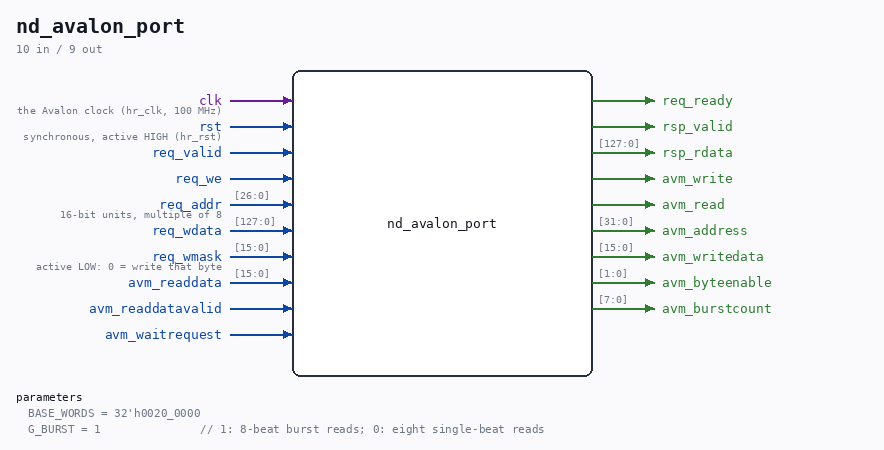

# nd_avalon_port

Source: `Verilog/fpga/mega65/rtl/nd_avalon_port.v`

> Generated by `Verilog/tests/module_doc.py` from the `//!`
> comments in the source. Do not edit by hand - edit the RTL comments and regenerate.

## Description

nd_avalon_port - the nd_ddr2_port contract on an Avalon-MM 16-bit master
(the MiSTer2MEGA65 HyperRAM port, MEGA65 R3)
Full path: Verilog/fpga/mega65/rtl/nd_avalon_port.v
WHAT THIS IS. The Nexys 4 DDR's main-memory backend is a BRAM cache
(fpga/nexys4ddr/ddr2/MEM_RAM_49_DDR2.v) in front of a plain request/
response port whose contract is written in nd_ddr2_port.v:
req_valid held until req_ready; req_we; req_addr in 16-BIT UNITS, a
multiple of 8 (one transfer = one 128-bit line = 8 units); req_wdata
128 bits; req_wmask ACTIVE-LOW byte mask (0 = write that byte);
rsp_valid one cycle with rsp_rdata (read) or as "done" (write). One
operation outstanding at a time.
That cache + the MEM_HOLD freeze absorb ANY latency, which is why the
contract is the right seam for a memory whose latency varies: the
MEGA65's HyperRAM, reached through the framework's Avalon-MM port
(CORE/vhdl/mega65.vhd hr_core_*: 16-bit data, WORD address, 8-bit
burstcount, waitrequest, readdatavalid; 100 MHz hr_clk). This module is
the port for it: the same contract on the client side, Avalon on the
other. Nothing above the seam knows the difference.
HOW EACH OPERATION MAPS
READ : one burst of 8 words (burstcount 8) from BASE + req_addr; the
8 readdatavalid beats fill rsp_rdata word 0 first (unit 0 =
bits [15:0], as nd_ddr2_port lays a line out). G_BURST = 0
turns that into 8 single-beat reads for a slave that cannot
burst - a build-time fallback, not the default.
WRITE: the cache only ever writes ONE 16-bit word into a line (its
wmask leaves 14 of 16 bytes masked), so a masked 8-beat burst
would move 7 useless beats. Instead every word whose mask
enables at least one byte gets its OWN single-beat write with
byteenable = ~mask (Avalon byteenable is ACTIVE-HIGH - the one
inversion this seam needs); fully masked words are skipped.
Usually that is exactly one beat.
AVALON RULES OBEYED: write/read/address/data/byteenable/burstcount are
held unchanged while waitrequest is high; read and write are never
asserted together; the address never leaves the window
[BASE_WORDS, BASE_WORDS + 2M words), the 4 MB the ND-120 map holds.
BASE_WORDS defaults to the framework's own boundary: globals.vhd
C_HMAP_DEMO = 0x0200 in units of 4 kW = word 0x200000; the first 4 MiB
of the 8 MiB part belong to the framework (video buffer for the HDMI
scaler).
Written 02-SEP-2026. Bench: sim/nd_avalon_port_tb.v against an Avalon
slave model with random waitrequest and read latency.

## Parameters

| Parameter | Default |
|---|---|
| `BASE_WORDS` | `32'h0020_0000` |
| `G_BURST` | `1               // 1: 8-beat burst reads; 0: eight single-beat reads` |

## Ports

| Direction | Width | Name | Description |
|---|---|---|---|
| input | `1` | `clk` | the Avalon clock (hr_clk, 100 MHz) |
| input | `1` | `rst` | synchronous, active HIGH (hr_rst) |
| input | `1` | `req_valid` |  |
| input | `1` | `req_we` |  |
| input | `[26:0]` | `req_addr` | 16-bit units, multiple of 8 |
| input | `[127:0]` | `req_wdata` |  |
| input | `[15:0]` | `req_wmask` | active LOW: 0 = write that byte |
| output | `1` | `req_ready` |  |
| output | `1` | `rsp_valid` |  |
| output | `[127:0]` | `rsp_rdata` |  |
| output | `1` | `avm_write` |  |
| output | `1` | `avm_read` |  |
| output | `[31:0]` | `avm_address` |  |
| output | `[15:0]` | `avm_writedata` |  |
| output | `[1:0]` | `avm_byteenable` |  |
| output | `[7:0]` | `avm_burstcount` |  |
| input | `[15:0]` | `avm_readdata` |  |
| input | `1` | `avm_readdatavalid` |  |
| input | `1` | `avm_waitrequest` |  |
