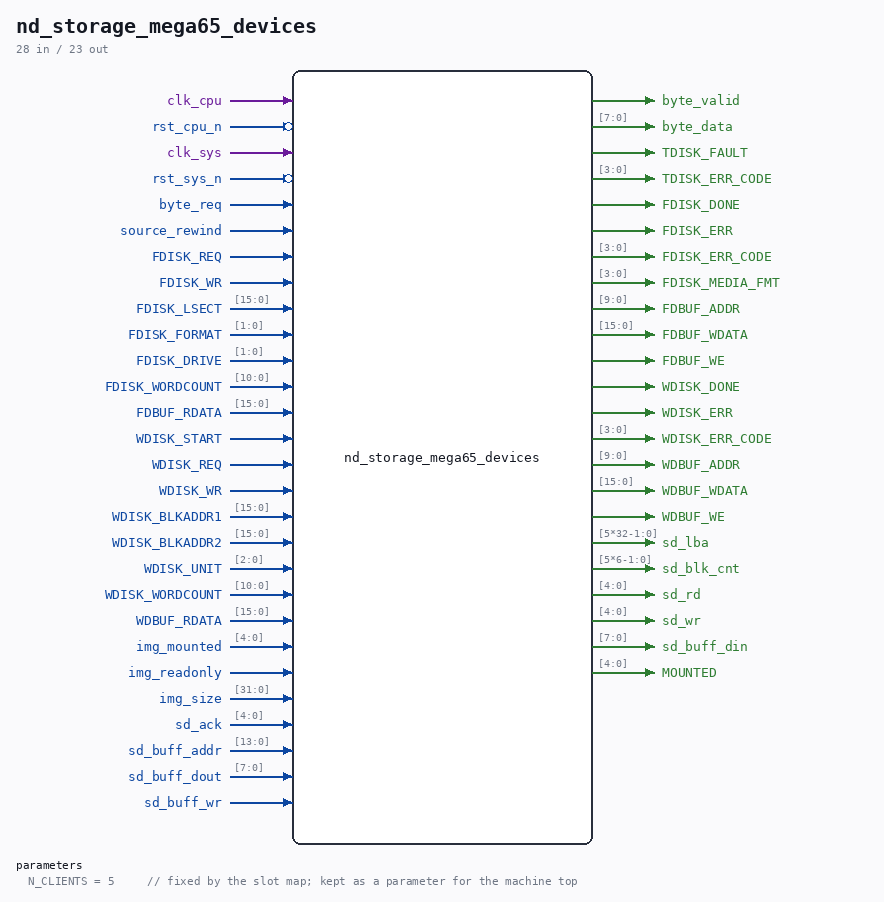

# nd_storage_mega65_devices

Source: `Verilog/fpga/mega65/rtl/nd_storage_mega65_devices.v`

> Generated by `Verilog/tests/module_doc.py` from the `//!`
> comments in the source. Do not edit by hand - edit the RTL comments and regenerate.

## Parameters

| Parameter | Default |
|---|---|
| `N_CLIENTS` | `5     // fixed by the slot map; kept as a parameter for the machine top` |

## Ports

| Direction | Width | Name | Description |
|---|---|---|---|
| input | `1` | `clk_cpu` |  |
| input | `1` | `rst_cpu_n` *(active low)* |  |
| input | `1` | `clk_sys` |  |
| input | `1` | `rst_sys_n` *(active low)* |  |
| input | `1` | `byte_req` |  |
| output | `1` | `byte_valid` |  |
| output | `[7:0]` | `byte_data` |  |
| input | `1` | `source_rewind` |  |
| output | `1` | `TDISK_FAULT` |  |
| output | `[3:0]` | `TDISK_ERR_CODE` |  |
| input | `1` | `FDISK_REQ` |  |
| input | `1` | `FDISK_WR` |  |
| input | `[15:0]` | `FDISK_LSECT` |  |
| input | `[1:0]` | `FDISK_FORMAT` |  |
| input | `[1:0]` | `FDISK_DRIVE` |  |
| input | `[10:0]` | `FDISK_WORDCOUNT` |  |
| output | `1` | `FDISK_DONE` |  |
| output | `1` | `FDISK_ERR` |  |
| output | `[3:0]` | `FDISK_ERR_CODE` |  |
| output | `[3:0]` | `FDISK_MEDIA_FMT` |  |
| output | `[9:0]` | `FDBUF_ADDR` |  |
| output | `[15:0]` | `FDBUF_WDATA` |  |
| output | `1` | `FDBUF_WE` |  |
| input | `[15:0]` | `FDBUF_RDATA` |  |
| input | `1` | `WDISK_START` |  |
| input | `1` | `WDISK_REQ` |  |
| input | `1` | `WDISK_WR` |  |
| input | `[15:0]` | `WDISK_BLKADDR1` |  |
| input | `[15:0]` | `WDISK_BLKADDR2` |  |
| input | `[2:0]` | `WDISK_UNIT` |  |
| input | `[10:0]` | `WDISK_WORDCOUNT` |  |
| output | `1` | `WDISK_DONE` |  |
| output | `1` | `WDISK_ERR` |  |
| output | `[3:0]` | `WDISK_ERR_CODE` |  |
| output | `[9:0]` | `WDBUF_ADDR` |  |
| output | `[15:0]` | `WDBUF_WDATA` |  |
| output | `1` | `WDBUF_WE` |  |
| input | `[15:0]` | `WDBUF_RDATA` |  |
| input | `[4:0]` | `img_mounted` |  |
| input | `1` | `img_readonly` |  |
| input | `[31:0]` | `img_size` |  |
| output | `[5*32-1:0]` | `sd_lba` |  |
| output | `[5*6-1:0]` | `sd_blk_cnt` |  |
| output | `[4:0]` | `sd_rd` |  |
| output | `[4:0]` | `sd_wr` |  |
| input | `[4:0]` | `sd_ack` |  |
| input | `[13:0]` | `sd_buff_addr` |  |
| input | `[7:0]` | `sd_buff_dout` |  |
| output | `[7:0]` | `sd_buff_din` |  |
| input | `1` | `sd_buff_wr` |  |
| output | `[4:0]` | `MOUNTED` |  |
