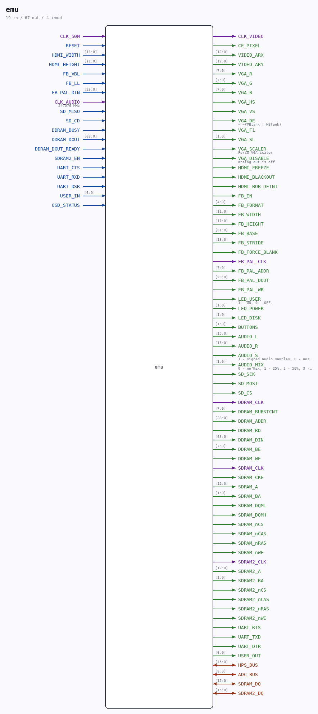

# emu

Source: `Verilog/fpga/mister/nd120.sv`

> Generated by `Verilog/tests/module_doc.py` from the `//!`
> comments in the source. Do not edit by hand - edit the RTL comments and regenerate.

<!-- HIERARCHY-NAV:BEGIN - written by Verilog/tests/gen_hierarchy.py, do not edit -->

**Where it sits** (MiSTer): **emu**

**Used in:** nothing - this is a top (MiSTer).

**Contains:** [console_uart_rx](../../../Terminals/rtl/doc/console_uart_rx.md), [console_uart_tx](../../../Terminals/rtl/doc/console_uart_tx.md), `hps_io` (vendor), [mips_counter](../../../Terminals/rtl/doc/mips_counter.md), [nd120_console_mister](../rtl/doc/nd120_console_mister.md), [ND120_CORE](../../../doc/ND120_CORE.md), [nd_storage_mister_devices](../rtl/doc/nd_storage_mister_devices.md), `pll` (vendor), [pll_cpu](../rtl/doc/pll_cpu.md)

[Module hierarchy](../../../HIERARCHY.md) - [All modules](../../../MODULES.md)

<!-- HIERARCHY-NAV:END -->

## Ports

| Direction | Width | Name | Description |
|---|---|---|---|
| input | `1` | `CLK_50M` |  |
| input | `1` | `RESET` |  |
| inout | `[45:0]` | `HPS_BUS` |  |
| output | `1` | `CLK_VIDEO` |  |
| output | `1` | `CE_PIXEL` |  |
| output | `[12:0]` | `VIDEO_ARX` |  |
| output | `[12:0]` | `VIDEO_ARY` |  |
| output | `[7:0]` | `VGA_R` |  |
| output | `[7:0]` | `VGA_G` |  |
| output | `[7:0]` | `VGA_B` |  |
| output | `1` | `VGA_HS` |  |
| output | `1` | `VGA_VS` |  |
| output | `1` | `VGA_DE` | = ~(VBlank \| HBlank) |
| output | `1` | `VGA_F1` |  |
| output | `[1:0]` | `VGA_SL` |  |
| output | `1` | `VGA_SCALER` | Force VGA scaler |
| output | `1` | `VGA_DISABLE` | analog out is off |
| input | `[11:0]` | `HDMI_WIDTH` |  |
| input | `[11:0]` | `HDMI_HEIGHT` |  |
| output | `1` | `HDMI_FREEZE` |  |
| output | `1` | `HDMI_BLACKOUT` |  |
| output | `1` | `HDMI_BOB_DEINT` |  |
| output | `1` | `FB_EN` |  |
| output | `[4:0]` | `FB_FORMAT` |  |
| output | `[11:0]` | `FB_WIDTH` |  |
| output | `[11:0]` | `FB_HEIGHT` |  |
| output | `[31:0]` | `FB_BASE` |  |
| output | `[13:0]` | `FB_STRIDE` |  |
| input | `1` | `FB_VBL` |  |
| input | `1` | `FB_LL` |  |
| output | `1` | `FB_FORCE_BLANK` |  |
| output | `1` | `FB_PAL_CLK` |  |
| output | `[7:0]` | `FB_PAL_ADDR` |  |
| output | `[23:0]` | `FB_PAL_DOUT` |  |
| input | `[23:0]` | `FB_PAL_DIN` |  |
| output | `1` | `FB_PAL_WR` |  |
| output | `1` | `LED_USER` | 1 - ON, 0 - OFF. |
| output | `[1:0]` | `LED_POWER` |  |
| output | `[1:0]` | `LED_DISK` |  |
| output | `[1:0]` | `BUTTONS` |  |
| input | `1` | `CLK_AUDIO` | 24.576 MHz |
| output | `[15:0]` | `AUDIO_L` |  |
| output | `[15:0]` | `AUDIO_R` |  |
| output | `1` | `AUDIO_S` | 1 - signed audio samples, 0 - unsigned |
| output | `[1:0]` | `AUDIO_MIX` | 0 - no mix, 1 - 25%, 2 - 50%, 3 - 100% (mono) |
| inout | `[3:0]` | `ADC_BUS` |  |
| output | `1` | `SD_SCK` |  |
| output | `1` | `SD_MOSI` |  |
| input | `1` | `SD_MISO` |  |
| output | `1` | `SD_CS` |  |
| input | `1` | `SD_CD` |  |
| output | `1` | `DDRAM_CLK` |  |
| input | `1` | `DDRAM_BUSY` |  |
| output | `[7:0]` | `DDRAM_BURSTCNT` |  |
| output | `[28:0]` | `DDRAM_ADDR` |  |
| input | `[63:0]` | `DDRAM_DOUT` |  |
| input | `1` | `DDRAM_DOUT_READY` |  |
| output | `1` | `DDRAM_RD` |  |
| output | `[63:0]` | `DDRAM_DIN` |  |
| output | `[7:0]` | `DDRAM_BE` |  |
| output | `1` | `DDRAM_WE` |  |
| output | `1` | `SDRAM_CLK` |  |
| output | `1` | `SDRAM_CKE` |  |
| output | `[12:0]` | `SDRAM_A` |  |
| output | `[1:0]` | `SDRAM_BA` |  |
| inout | `[15:0]` | `SDRAM_DQ` |  |
| output | `1` | `SDRAM_DQML` |  |
| output | `1` | `SDRAM_DQMH` |  |
| output | `1` | `SDRAM_nCS` |  |
| output | `1` | `SDRAM_nCAS` |  |
| output | `1` | `SDRAM_nRAS` |  |
| output | `1` | `SDRAM_nWE` |  |
| input | `1` | `SDRAM2_EN` |  |
| output | `1` | `SDRAM2_CLK` |  |
| output | `[12:0]` | `SDRAM2_A` |  |
| output | `[1:0]` | `SDRAM2_BA` |  |
| inout | `[15:0]` | `SDRAM2_DQ` |  |
| output | `1` | `SDRAM2_nCS` |  |
| output | `1` | `SDRAM2_nCAS` |  |
| output | `1` | `SDRAM2_nRAS` |  |
| output | `1` | `SDRAM2_nWE` |  |
| input | `1` | `UART_CTS` |  |
| output | `1` | `UART_RTS` |  |
| input | `1` | `UART_RXD` |  |
| output | `1` | `UART_TXD` |  |
| output | `1` | `UART_DTR` |  |
| input | `1` | `UART_DSR` |  |
| input | `[6:0]` | `USER_IN` |  |
| output | `[6:0]` | `USER_OUT` |  |
| input | `1` | `OSD_STATUS` |  |
