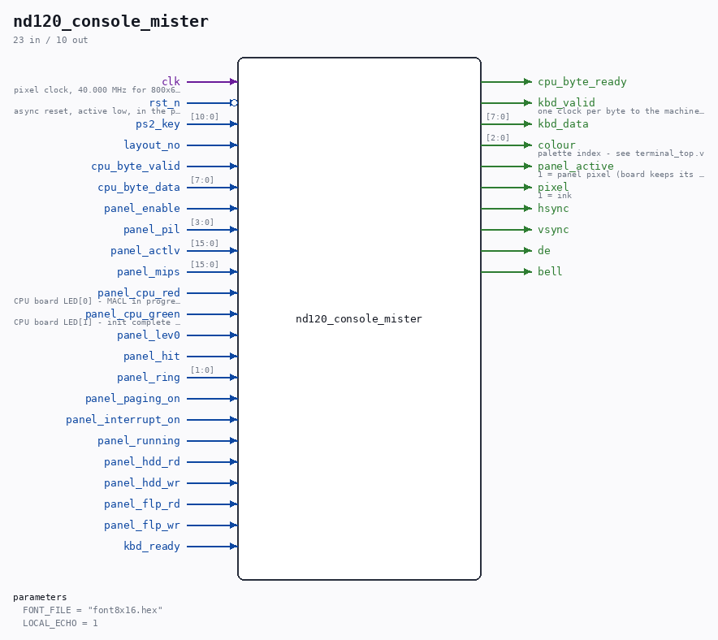

# nd120_console_mister

Source: `Verilog/fpga/mister/rtl/nd120_console_mister.v`

> Generated by `Verilog/tests/module_doc.py` from the `//!`
> comments in the source. Do not edit by hand - edit the RTL comments and regenerate.

<!-- HIERARCHY-NAV:BEGIN - written by Verilog/tests/gen_hierarchy.py, do not edit -->

**Where it sits** (MiSTer): [emu](../../doc/emu.md) > **nd120_console_mister**
- instance path: `CONSOLE`

**Used in:** [emu](../../doc/emu.md) (MiSTer)

**Contains:** [key_tdv2200](../../../../Terminals/rtl/doc/key_tdv2200.md), [ps2_decoder_tdv](../../../../Terminals/rtl/doc/ps2_decoder_tdv.md), [term_console_feed](../../../../Terminals/rtl/doc/term_console_feed.md), [terminal_top](../../../../Terminals/rtl/doc/terminal_top.md)

[Module hierarchy](../../../../HIERARCHY.md) - [All modules](../../../../MODULES.md)

<!-- HIERARCHY-NAV:END -->

## Parameters

| Parameter | Default |
|---|---|
| `FONT_FILE` | `"font8x16.hex"` |
| `LOCAL_ECHO` | `1` |

## Ports

| Direction | Width | Name | Description |
|---|---|---|---|
| input | `1` | `clk` | pixel clock, 40.000 MHz for 800x600@60 |
| input | `1` | `rst_n` *(active low)* | async reset, active low, in the pixel domain |
| input | `[10:0]` | `ps2_key` |  |
| input | `1` | `layout_no` |  |
| input | `1` | `cpu_byte_valid` |  |
| input | `[7:0]` | `cpu_byte_data` |  |
| output | `1` | `cpu_byte_ready` |  |
| input | `1` | `panel_enable` |  |
| input | `[3:0]` | `panel_pil` |  |
| input | `[15:0]` | `panel_actlv` |  |
| input | `[15:0]` | `panel_mips` |  |
| input | `1` | `panel_cpu_red` | CPU board LED[0] - MACL in progress |
| input | `1` | `panel_cpu_green` | CPU board LED[1] - init complete (self-test passed) |
| input | `1` | `panel_lev0` |  |
| input | `1` | `panel_hit` |  |
| input | `[1:0]` | `panel_ring` |  |
| input | `1` | `panel_paging_on` |  |
| input | `1` | `panel_interrupt_on` |  |
| input | `1` | `panel_running` |  |
| input | `1` | `panel_hdd_rd` |  |
| input | `1` | `panel_hdd_wr` |  |
| input | `1` | `panel_flp_rd` |  |
| input | `1` | `panel_flp_wr` |  |
| input | `1` | `kbd_ready` |  |
| output | `1` | `kbd_valid` | one clock per byte to the machine, gated by kbd_ready |
| output | `[7:0]` | `kbd_data` |  |
| output | `[2:0]` | `colour` | palette index - see terminal_top.v |
| output | `1` | `panel_active` | 1 = panel pixel (board keeps its lamp green) |
| output | `1` | `pixel` | 1 = ink |
| output | `1` | `hsync` |  |
| output | `1` | `vsync` |  |
| output | `1` | `de` |  |
| output | `1` | `bell` |  |
