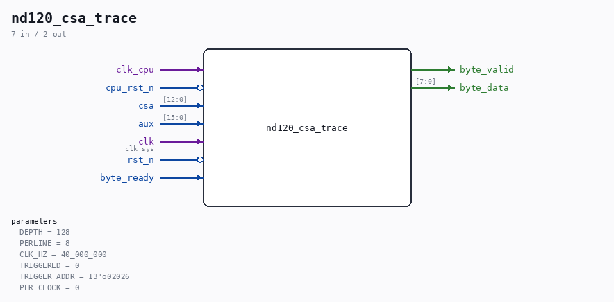

# nd120_csa_trace

Source: `Verilog/fpga/mister/rtl/nd120_csa_trace.v`

> Generated by `Verilog/tests/module_doc.py` from the `//!`
> comments in the source. Do not edit by hand - edit the RTL comments and regenerate.

## Description

nd120_csa_trace.v - print the last N microcode addresses, in order
WHY (01-SEP-2026)
----------------
nd120_diag_print.v samples CSA once a second and showed the MiSTer board
visiting about eleven microcode addresses over and over. That was
misleading: one sample per second against a tight loop ALIASES, so the
eleven addresses were arbitrary points inside the loop, not the loop
itself. The giveaway was that two different builds printed the same
eleven values in the same order - a sampler hitting a periodic signal.
To identify what the microcode is actually doing, the CONSECUTIVE
sequence is needed, which is exactly what Verilator's csa_trace.csv
gives for a machine that boots. This module produces the same thing from
silicon: a circular buffer of the last DEPTH microcode addresses, dumped
to the console as octal so it can be read off a screenshot and diffed
against the simulator's trace.
Only CHANGES are recorded, one entry per new address, matching how
csa_trace.csv is written - otherwise a slow microinstruction would fill
the buffer with copies of itself.
CLOCK DOMAINS. Capture runs on clk_cpu; the dump runs on clk_sys. The
buffer is FROZEN while dumping (r_hold), so the reader sees a still
picture rather than entries changing under it. That costs nothing here -
the machine is stuck in a loop, so the next snapshot shows the same loop.
DIAGNOSTIC SCAFFOLDING, built only under ND120_DIAG_PRINT. Not part of
the machine.

## Parameters

| Parameter | Default |
|---|---|
| `DEPTH` | `128` |
| `PERLINE` | `8` |
| `CLK_HZ` | `40_000_000` |
| `TRIGGERED` | `0` |
| `TRIGGER_ADDR` | `13'o02026` |
| `PER_CLOCK` | `0` |

## Ports

| Direction | Width | Name | Description |
|---|---|---|---|
| input | `1` | `clk_cpu` |  |
| input | `1` | `cpu_rst_n` *(active low)* |  |
| input | `[12:0]` | `csa` |  |
| input | `[15:0]` | `aux` |  |
| input | `1` | `clk` | clk_sys |
| input | `1` | `rst_n` *(active low)* |  |
| output | `1` | `byte_valid` |  |
| output | `[7:0]` | `byte_data` |  |
| input | `1` | `byte_ready` |  |
