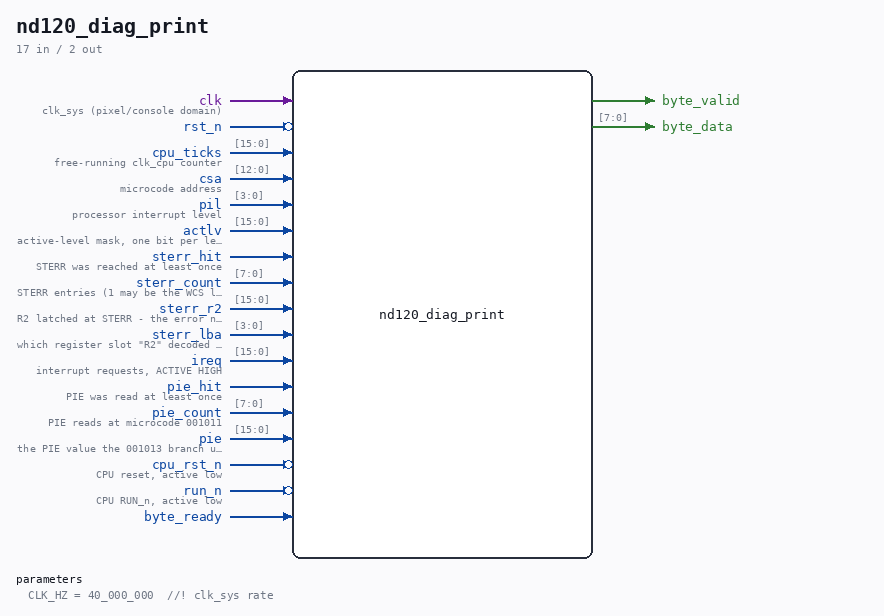

# nd120_diag_print

Source: `Verilog/fpga/mister/rtl/nd120_diag_print.v`

> Generated by `Verilog/tests/module_doc.py` from the `//!`
> comments in the source. Do not edit by hand - edit the RTL comments and regenerate.

## Description

nd120_diag_print.v - CPU state, printed onto the console
WHY THIS EXISTS (31-AUG-2026)
------------------------------
On MiSTer the console, the operator panel and the uptime counter all work
- they live in the pixel clock domain - while the CPU shows no sign of
life: no OPCOM '#', no echo, MIPS 00.00. Everything the build reports is
clean (0 errors, WCS microcode initialised from MIF, CPU clock a real PLL
output on a global network, timing met), so the remaining question is not
"does a report look wrong" but "what is the CPU actually DOING".
A screenshot of the running core can be pulled off the board over ssh
("screenshot" > /dev/MiSTer_cmd), so anything printed on the console can
be read back without anyone watching the monitor.
WHAT EACH FIELD ANSWERS
-----------------------
CK   free-running counter clocked by clk_cpu. Proves the CPU clock is
toggling in silicon and that the CPU reset was released - neither
of which simulation or the timing report can tell us.
CSA  the microcode address. NOTE its limits: sampled once a second, it
ALIASES against a tight loop and shows arbitrary points inside it,
not the loop. Use nd120_csa_trace.v for the real sequence.
PIL  processor interrupt level.    AL  active-level mask.
R    cpu_rst_n.                    N   RUN_n (active low).
ST   the self-test failure branch: hit flag / entry count, and R2 -
the error number STERR exists to display (see
rtl/nd120_sterr_catch.v). LB is the register slot "R2" decoded to.
IQ   the raw interrupt-request vector, ALREADY INVERTED by the caller
so a 1 bit means "this level is requesting". The core drives it
active low as DEBUG_IREQ_15_0_N; printing it raw would mean
reading a wall of ones and mentally inverting every bit.
Values are OCTAL. This is an octal machine and these are compared against
octal microcode listings; hex would mean converting by hand every time.
CLOCK DOMAINS. Everything from the CPU belongs to clk_cpu; this module
runs on clk_sys and samples through two flops. That is enough for a
DISPLAY - a sample taken mid-change can show a torn value for one line -
but it is not a synchroniser for control logic, and this module drives
nothing but text.
DIAGNOSTIC SCAFFOLDING, compiled in only when ND120_DIAG_PRINT is
defined. It is not part of the machine.

## Parameters

| Parameter | Default |
|---|---|
| `CLK_HZ` | `40_000_000  //! clk_sys rate` |

## Ports

| Direction | Width | Name | Description |
|---|---|---|---|
| input | `1` | `clk` | clk_sys (pixel/console domain) |
| input | `1` | `rst_n` *(active low)* |  |
| input | `[15:0]` | `cpu_ticks` | free-running clk_cpu counter |
| input | `[12:0]` | `csa` | microcode address |
| input | `[3:0]` | `pil` | processor interrupt level |
| input | `[15:0]` | `actlv` | active-level mask, one bit per level |
| input | `1` | `sterr_hit` | STERR was reached at least once |
| input | `[7:0]` | `sterr_count` | STERR entries (1 may be the WCS loader) |
| input | `[15:0]` | `sterr_r2` | R2 latched at STERR - the error number |
| input | `[3:0]` | `sterr_lba` | which register slot "R2" decoded to |
| input | `[15:0]` | `ireq` | interrupt requests, ACTIVE HIGH |
| input | `1` | `pie_hit` | PIE was read at least once |
| input | `[7:0]` | `pie_count` | PIE reads at microcode 001011 |
| input | `[15:0]` | `pie` | the PIE value the 001013 branch uses |
| input | `1` | `cpu_rst_n` *(active low)* | CPU reset, active low |
| input | `1` | `run_n` *(active low)* | CPU RUN_n, active low |
| output | `1` | `byte_valid` |  |
| output | `[7:0]` | `byte_data` |  |
| input | `1` | `byte_ready` |  |
