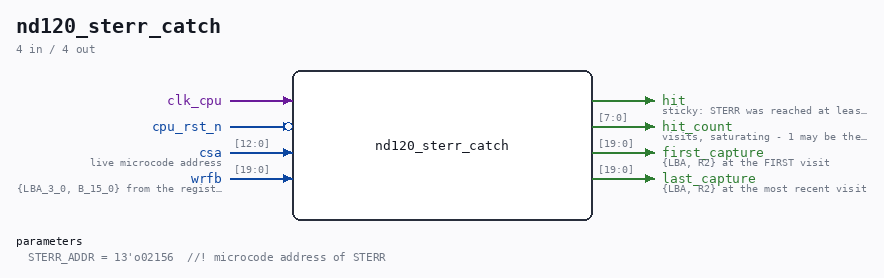

# nd120_sterr_catch

Source: `Verilog/fpga/mister/rtl/nd120_sterr_catch.v`

> Generated by `Verilog/tests/module_doc.py` from the `//!`
> comments in the source. Do not edit by hand - edit the RTL comments and regenerate.

## Description

nd120_sterr_catch.v - catch the self-test failure and report its number
WHY (01-SEP-2026, Ronny's call)
-------------------------------
The MiSTer board reaches no OPCOM prompt. Sampling the microcode address
once a second was a dead end - it ALIASES against a tight loop and reports
arbitrary points inside it. The direct question is instead: did the
microcode take the self-test failure branch, and if so with what error?
The DELILAH microcode answers it at address 002156:
% DISPLAY ERROR NO. R2
STERR:  B,R2   ALUF,PASSB  ALUD,Q
IDBS,ALU           T,JMP  T,PUSH DYTP2;
ALUF,PASSQ ALUD,NONE  % LOOP ON ERROR
IDBS,ALU   COMM,LDPIL  T,RETURN T,HOLD;
So STERR selects R2 onto the register file's B port. This module watches
for CSA == 002156 and latches that port. The value it captures IS R2, by
construction - no need to know which of the sixteen register slots the
microcode assembler's name "R2" decodes to. The captured LBA field reports
that slot as a by-product, which settles the question for good.
CAREFUL - not every visit counts. The WCS loader walks PAST the STERR
address once while loading microcode (noted in CLAUDE.md); only
execution-phase visits mean a real self-test failure. This module
therefore reports a COUNT as well as the value, and keeps BOTH the first
and the most recent capture, so a single spurious walk-past is visible as
count==1 rather than being mistaken for a failure.
DIAGNOSTIC SCAFFOLDING, built only under ND120_DIAG_PRINT.

## Parameters

| Parameter | Default |
|---|---|
| `STERR_ADDR` | `13'o02156  //! microcode address of STERR` |

## Ports

| Direction | Width | Name | Description |
|---|---|---|---|
| input | `1` | `clk_cpu` |  |
| input | `1` | `cpu_rst_n` *(active low)* |  |
| input | `[12:0]` | `csa` | live microcode address |
| input | `[19:0]` | `wrfb` | {LBA_3_0, B_15_0} from the register file |
| output | `1` | `hit` | sticky: STERR was reached at least once |
| output | `[7:0]` | `hit_count` | visits, saturating - 1 may be the loader |
| output | `[19:0]` | `first_capture` | {LBA, R2} at the FIRST visit |
| output | `[19:0]` | `last_capture` | {LBA, R2} at the most recent visit |
