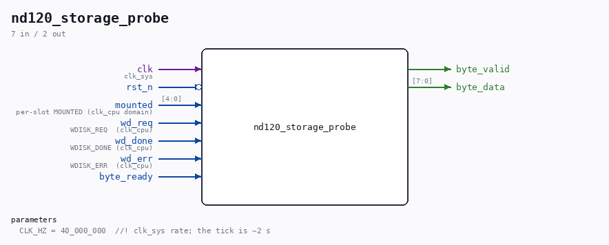

# nd120_storage_probe

Source: `Verilog/fpga/mister/rtl/nd120_storage_probe.v`

<!-- Generated by Verilog/tests/module_doc.py from the //! comments in the source. Do not edit by hand - edit the RTL comments and regenerate. -->

<!-- HIERARCHY-NAV:BEGIN - written by Verilog/tests/gen_hierarchy.py, do not edit -->

**Hierarchy:** not instantiated by any of the 9 build tops (elaborated by yosys).

[Module hierarchy](../../../../HIERARCHY.md) - [All modules](../../../../MODULES.md)

<!-- HIERARCHY-NAV:END -->

## Description

nd120_storage_probe.v - storage mount + Winchester activity, on the
console
WHY (02-SEP-2026). An automounted WD0 hangs on the first Winchester read
(R lamp stuck), while an OSD-mounted WD0 boots. Sim ruled out the RTL
reset CDC (test-storage-reset), so the difference is on the real ARM's
mount service, which only the board can show. This prints, once every two
seconds, exactly the two facts that separate the theories:
STOR MNT=fwWt WDr=nnnnn WDd=nnnnn WDe=nnnnn
MNT   the five per-slot MOUNTED flags as 0/1 (floppy0 floppy1 WD0 WD1
tape), so we see whether the automounted slot is actually open.
WDr   sticky count of WDISK_REQ rising edges  (a read/write was issued)
WDd   sticky count of WDISK_DONE rising edges (the backend completed one)
WDe   sticky count of WDISK_ERR pulses        (completed WITH an error)
If the read hangs: MNT shows whether WD0 mounted, and WDr > WDd with
WDe = 0 is a request that never completed - the stuck-read signature. If
instead WDd tracks WDr with WDe climbing, the reads complete but error.
Counts are OCTAL (this is an octal machine), 15-bit, 5 digits, saturating.
It runs on clk_sys and samples the clk_cpu-domain seam through two flops -
enough for a display (a torn count for one line is harmless), not a
synchroniser for control. It drives nothing but text, at a priority BELOW
the CPU's own console output (see the mux in nd120.sv), so it fills the
quiet the hang creates and never fights live output.
DIAGNOSTIC SCAFFOLDING, compiled only when ND120_STORAGE_PROBE is defined.

## Parameters

| Parameter | Default |
|---|---|
| `CLK_HZ` | `40_000_000  //! clk_sys rate; the tick is ~2 s` |

## Ports

| Direction | Width | Name | Description |
|---|---|---|---|
| input | `1` | `clk` | clk_sys |
| input | `1` | `rst_n` *(active low)* |  |
| input | `[4:0]` | `mounted` | per-slot MOUNTED (clk_cpu domain) |
| input | `1` | `wd_req` | WDISK_REQ  (clk_cpu) |
| input | `1` | `wd_done` | WDISK_DONE (clk_cpu) |
| input | `1` | `wd_err` | WDISK_ERR  (clk_cpu) |
| output | `1` | `byte_valid` |  |
| output | `[7:0]` | `byte_data` |  |
| input | `1` | `byte_ready` |  |
