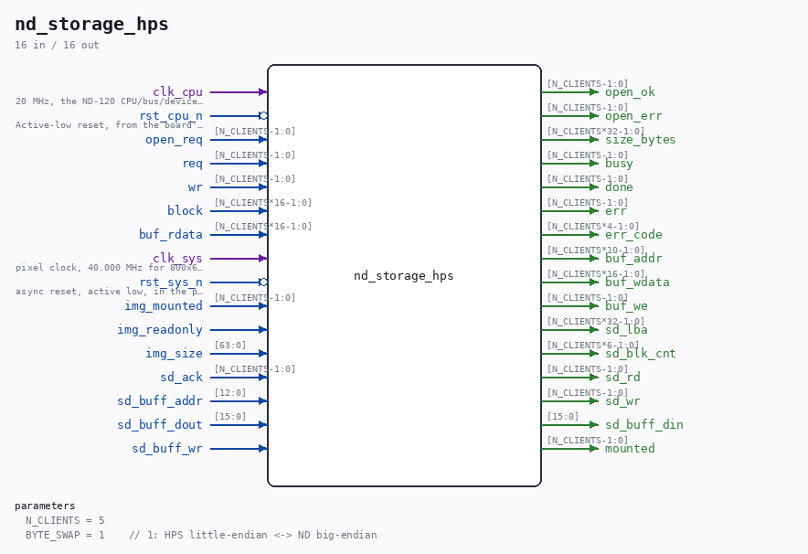

# nd_storage_hps

Source: `Verilog/fpga/mister/rtl/nd_storage_hps.v`

<!-- Generated by Verilog/tests/module_doc.py from the //! comments in the source. Do not edit by hand - edit the RTL comments and regenerate. -->

<!-- HIERARCHY-NAV:BEGIN - written by Verilog/tests/gen_hierarchy.py, do not edit -->

**Where it sits** (MiSTer): [emu](../../doc/emu.md) > [nd_storage_mister_devices](nd_storage_mister_devices.md) > **nd_storage_hps**
- instance path: `STORAGE.u_hps`

**Used in:** [nd_storage_mister_devices](nd_storage_mister_devices.md) (MiSTer)

**Contains:** no other modules.

[Module hierarchy](../../../../HIERARCHY.md) - [All modules](../../../../MODULES.md)

<!-- HIERARCHY-NAV:END -->

## Parameters

| Parameter | Default |
|---|---|
| `N_CLIENTS` | `5` |
| `BYTE_SWAP` | `1    // 1: HPS little-endian <-> ND big-endian` |

## Ports

| Direction | Width | Name | Description |
|---|---|---|---|
| input | `1` | `clk_cpu` |  |
| input | `1` | `rst_cpu_n` *(active low)* |  |
| input | `[N_CLIENTS-1:0]` | `open_req` |  |
| output | `[N_CLIENTS-1:0]` | `open_ok` |  |
| output | `[N_CLIENTS-1:0]` | `open_err` |  |
| output | `[N_CLIENTS*32-1:0]` | `size_bytes` |  |
| input | `[N_CLIENTS-1:0]` | `req` |  |
| input | `[N_CLIENTS-1:0]` | `wr` |  |
| input | `[N_CLIENTS*16-1:0]` | `block` |  |
| output | `[N_CLIENTS-1:0]` | `busy` |  |
| output | `[N_CLIENTS-1:0]` | `done` |  |
| output | `[N_CLIENTS-1:0]` | `err` |  |
| output | `[N_CLIENTS*4-1:0]` | `err_code` |  |
| output | `[N_CLIENTS*10-1:0]` | `buf_addr` |  |
| output | `[N_CLIENTS*16-1:0]` | `buf_wdata` |  |
| output | `[N_CLIENTS-1:0]` | `buf_we` |  |
| input | `[N_CLIENTS*16-1:0]` | `buf_rdata` |  |
| input | `1` | `clk_sys` |  |
| input | `1` | `rst_sys_n` *(active low)* |  |
| input | `[N_CLIENTS-1:0]` | `img_mounted` |  |
| input | `1` | `img_readonly` |  |
| input | `[63:0]` | `img_size` |  |
| output | `[N_CLIENTS*32-1:0]` | `sd_lba` |  |
| output | `[N_CLIENTS*6-1:0]` | `sd_blk_cnt` |  |
| output | `[N_CLIENTS-1:0]` | `sd_rd` |  |
| output | `[N_CLIENTS-1:0]` | `sd_wr` |  |
| input | `[N_CLIENTS-1:0]` | `sd_ack` |  |
| input | `[12:0]` | `sd_buff_addr` |  |
| input | `[15:0]` | `sd_buff_dout` |  |
| output | `[15:0]` | `sd_buff_din` |  |
| input | `1` | `sd_buff_wr` |  |
| output | `[N_CLIENTS-1:0]` | `mounted` |  |
