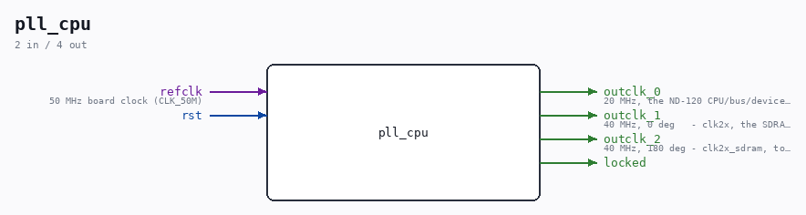

# pll_cpu

Source: `Verilog/fpga/mister/rtl/pll_cpu.v`

> Generated by `Verilog/tests/module_doc.py` from the `//!`
> comments in the source. Do not edit by hand - edit the RTL comments and regenerate.

## Ports

| Direction | Width | Name | Description |
|---|---|---|---|
| input | `1` | `refclk` | 50 MHz board clock (CLK_50M) |
| input | `1` | `rst` |  |
| output | `1` | `outclk_0` | 20 MHz, the ND-120 CPU/bus/device domain |
| output | `1` | `outclk_1` | 40 MHz, 0 deg   - clk2x, the SDRAM controller |
| output | `1` | `outclk_2` | 40 MHz, 180 deg - clk2x_sdram, to the SDRAM chip |
| output | `1` | `locked` |  |
