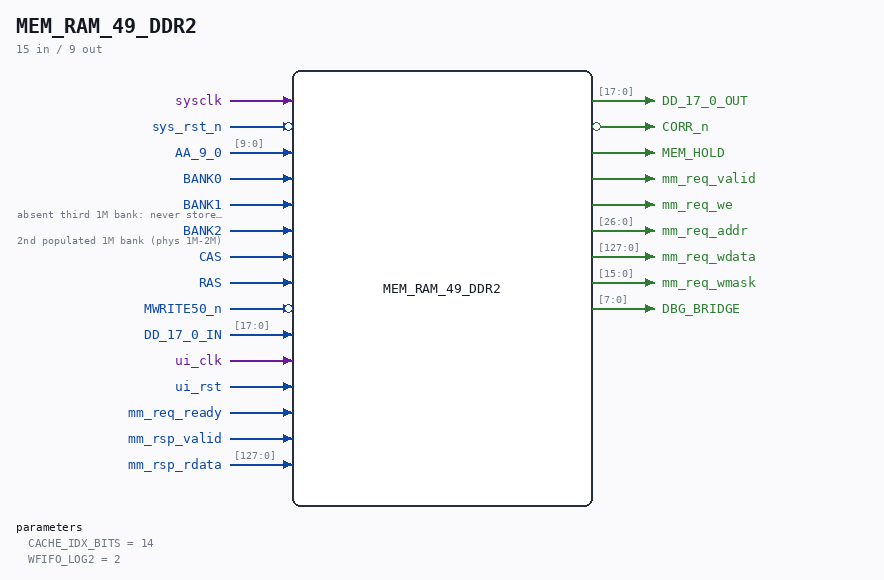

# MEM_RAM_49_DDR2

Source: `Verilog/fpga/nexys4ddr/ddr2/MEM_RAM_49_DDR2.v`

> Generated by `Verilog/tests/module_doc.py` from the `//!`
> comments in the source. Do not edit by hand - edit the RTL comments and regenerate.

## Description

ND120 CPU, MM&M
MEM/RAM - DDR2 backend (Nexys 4 DDR)
Drop-in replacement for the sheet-49 RAM (MEM_RAM_49) that maps the
ND-120 DRAM protocol onto the board's 128 MiB DDR2 through
nd_ddr2_port, with a BRAM cache in front so the common case answers
at BRAM speed (one sysclk) and only a cache miss stretches the cycle.
Protocol contract (measured, docs/nd120-dram-memory.md section 4;
N = OSC cycle of the RAS rising edge):
N   : row on AA_9_0, MWRITE50_n and BANKx valid
N+1 : column on AA_9_0
N+2 : CAS rises, write data DD_17_0_IN valid
N+4 : read data must be on DD_17_0_OUT (held while CAS high)
N+5 : RAS falls, CAS tail one more cycle
Next access no earlier than N+11.
WHY A CACHE + HOLD, NOT A DIRECT BRIDGE: the deadline above is fixed
by PAL_44902A ("NO WAIT STATE ON CPU TO MEMORY WRITE") and the MIG's
read latency is variable (its internal DDR2 refresh alone is tRFC =
127.5 ns), so a direct bridge cannot promise the deadline - see
fpga/nexys4ddr/EXTENSIONS-PLAN.md. Instead:
HIT : the cache (BRAM, synchronous read) is looked up at N+1 and
serves data at the start of N+3 - the same registered timing
the proven MEM_RAM_49_BLOCKRAM path used.
MISS: MEM_HOLD freezes the two registered control PALs
(PAL_44803A grants, PAL_44902A RAS/CAS FSM) via their HOLD
input, which stretches the memory cycle. This is legal: the
CPU's cycle FSM (PAL_44601B state e) waits on CGNTCACT_n =
~(CGNT|CACT) (PAL_44302B), which tracks the frozen grant
LEVEL, and DMA masters wait on BDRY_n (PAL_44310D), whose set
terms need the post-RAS phases that the freeze postpones. The
DGA TOUT watchdog is fed by every COMPLETING cycle through
BDRY50, so sub-microsecond stretches never trip it.
CACHE: direct-mapped, write-through, 8-word lines (one 128-bit DDR2
transfer), no allocate on write miss. 2^CACHE_IDX_BITS lines; the
line data lives in eight parallel 16-bit BRAMs so a refill is a
single-cycle write of the whole line. Write-through means DDR2 always
holds the truth, so cache contents stay coherent across a soft reset
and there are no dirty lines to evict. All memory traffic - CPU and
DMA alike - flows through this one sheet-49 port, so there is no
other master to stay coherent with.
CAPACITY: 2M x 16-bit words = BANK0 + BANK2 (1M words each) = 4 MB,
the same map as the Tang's MEM_RAM_49_SDRAM: the board decode PAL
(PAL_44445B) orders the banks BANK0, BANK2, BANK1 in physical
addresses, so the contiguous 4 MB is BANK0+BANK2 and BANK1 reports
absent (reads 0, writes dropped) for the boot-time size probing.
PARITY: pack16 policy (docs/nd120-parity-analysis.md): only the 16
data bits are stored; DD[8]/DD[17] are regenerated as odd parity on
the read path and CORR_n always reports "correct".
DDR2 MAP: ND word address {bank, row[9:0], col[9:0]} (21 bits) maps
one word per 16-bit DDR2 unit at units 0 .. 0x1FFFFF (bottom 4 MiB).
The nd_storage region sits at REGION_BASE_UNITS = 0x2000000 (64 MiB
in), so the two can never collide. Both clients reach the single
nd_ddr2_port through nd_ddr2_arb at the board top.
CLOCK DOMAINS: the protocol side runs on sysclk (= clk_cpu). One
operation at a time crosses to ui_clk (the MIG user clock) as a
toggle with the payload held stable behind it, completion comes back
as a second toggle - the same shape nd_ddr2_storage uses.
Last reviewed: 25-AUG-2026
Ronny Hansen

## Parameters

| Parameter | Default |
|---|---|
| `CACHE_IDX_BITS` | `14` |
| `WFIFO_LOG2` | `2` |

## Ports

| Direction | Width | Name | Description |
|---|---|---|---|
| input | `1` | `sysclk` |  |
| input | `1` | `sys_rst_n` *(active low)* |  |
| input | `[9:0]` | `AA_9_0` |  |
| input | `1` | `BANK0` |  |
| input | `1` | `BANK1` | absent third 1M bank: never stored, reads 0 |
| input | `1` | `BANK2` | 2nd populated 1M bank (phys 1M-2M) |
| input | `1` | `CAS` |  |
| input | `1` | `RAS` |  |
| input | `1` | `MWRITE50_n` *(active low)* |  |
| input | `[17:0]` | `DD_17_0_IN` |  |
| output | `[17:0]` | `DD_17_0_OUT` |  |
| output | `1` | `CORR_n` *(active low)* |  |
| output | `1` | `MEM_HOLD` |  |
| input | `1` | `ui_clk` |  |
| input | `1` | `ui_rst` |  |
| output | `1` | `mm_req_valid` |  |
| output | `1` | `mm_req_we` |  |
| output | `[26:0]` | `mm_req_addr` |  |
| output | `[127:0]` | `mm_req_wdata` |  |
| output | `[15:0]` | `mm_req_wmask` |  |
| input | `1` | `mm_req_ready` |  |
| input | `1` | `mm_rsp_valid` |  |
| input | `[127:0]` | `mm_rsp_rdata` |  |
| output | `[7:0]` | `DBG_BRIDGE` |  |
