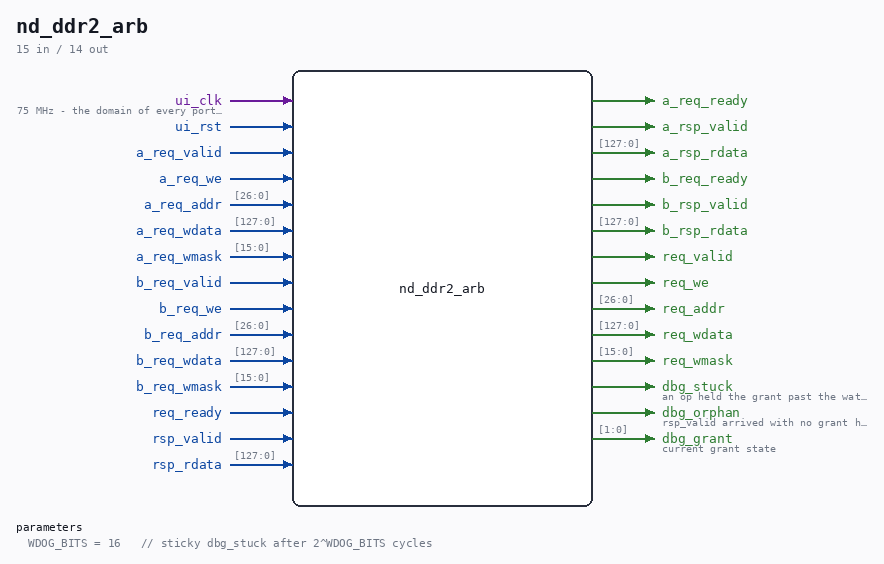

# nd_ddr2_arb

Source: `Verilog/fpga/nexys4ddr/ddr2/nd_ddr2_arb.v`

> Generated by `Verilog/tests/module_doc.py` from the `//!`
> comments in the source. Do not edit by hand - edit the RTL comments and regenerate.

<!-- HIERARCHY-NAV:BEGIN - written by Verilog/tests/gen_hierarchy.py, do not edit -->

**Where it sits** (Nexys): [nd120_nexys4ddr_top](../../doc/nd120_nexys4ddr_top.md) > **nd_ddr2_arb**
- instance path: `u_arb`

**Used in:** [nd120_nexys4ddr_top](../../doc/nd120_nexys4ddr_top.md) (Nexys)

**Contains:** no other modules.

[Module hierarchy](../../../../HIERARCHY.md) - [All modules](../../../../MODULES.md)

<!-- HIERARCHY-NAV:END -->

## Description

nd_ddr2_arb - two clients on one nd_ddr2_port
Client A: ND-120 main memory (MEM_RAM_49_DDR2) - bottom 4 MiB region.
Client B: nd_ddr2_storage - region at REGION_BASE_UNITS (64 MiB in).
Regions never overlap, so the arbiter only serializes access, it never
translates addresses.
Everything is in the ui_clk domain. Each client already holds
req_valid until req_ready and runs ONE operation at a time, so the
arbiter is a plain two-way lock: grab the port for whichever client
asks (ties alternate between the clients), hold it until that
operation's rsp_valid, then free it. rsp_valid is steered back to the
owning client only.
Fairness: when BOTH clients ask in the same idle cycle, the grant goes
to the one that did NOT run last, so a back-to-back stream from one
client (every CPU write is a write-through) cannot starve the other.
A lone requester is granted immediately either way.
Watchdog: an operation holding the grant for 2^WDOG_BITS ui_clk cycles
(default 2^16 = 874 us at 75 MHz, orders of magnitude past any MIG
refresh/ZQ blackout) sets the sticky dbg_stuck flag. The grant is NOT
released and no response is faked: a made-up completion handed to
MEM_RAM_49_DDR2 mid-operation is the 25-AUG stale-word corruption
class all over again. The flag turns a silent freeze into a
diagnosable one.
Orphan responses: rsp_valid with no grant held is steered to nobody by
construction; sticky dbg_orphan records that it happened at all.
Last reviewed: 25-AUG-2026
Ronny Hansen

## Parameters

| Parameter | Default |
|---|---|
| `WDOG_BITS` | `16   // sticky dbg_stuck after 2^WDOG_BITS cycles` |

## Ports

| Direction | Width | Name | Description |
|---|---|---|---|
| input | `1` | `ui_clk` |  |
| input | `1` | `ui_rst` |  |
| input | `1` | `a_req_valid` |  |
| input | `1` | `a_req_we` |  |
| input | `[26:0]` | `a_req_addr` |  |
| input | `[127:0]` | `a_req_wdata` |  |
| input | `[15:0]` | `a_req_wmask` |  |
| output | `1` | `a_req_ready` |  |
| output | `1` | `a_rsp_valid` |  |
| output | `[127:0]` | `a_rsp_rdata` |  |
| input | `1` | `b_req_valid` |  |
| input | `1` | `b_req_we` |  |
| input | `[26:0]` | `b_req_addr` |  |
| input | `[127:0]` | `b_req_wdata` |  |
| input | `[15:0]` | `b_req_wmask` |  |
| output | `1` | `b_req_ready` |  |
| output | `1` | `b_rsp_valid` |  |
| output | `[127:0]` | `b_rsp_rdata` |  |
| output | `1` | `req_valid` |  |
| output | `1` | `req_we` |  |
| output | `[26:0]` | `req_addr` |  |
| output | `[127:0]` | `req_wdata` |  |
| output | `[15:0]` | `req_wmask` |  |
| input | `1` | `req_ready` |  |
| input | `1` | `rsp_valid` |  |
| input | `[127:0]` | `rsp_rdata` |  |
| output | `1` | `dbg_stuck` | an op held the grant past the watchdog |
| output | `1` | `dbg_orphan` | rsp_valid arrived with no grant held |
| output | `[1:0]` | `dbg_grant` | current grant state |
