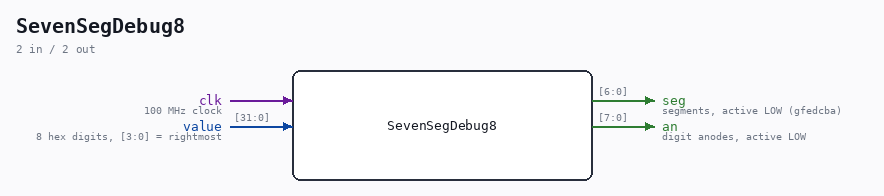

# SevenSegDebug8

Source: `Verilog/fpga/nexys4ddr/SevenSegDebug8.v`

> Generated by `Verilog/tests/module_doc.py` from the `//!`
> comments in the source. Do not edit by hand - edit the RTL comments and regenerate.

<!-- HIERARCHY-NAV:BEGIN - written by Verilog/tests/gen_hierarchy.py, do not edit -->

**Where it sits** (Nexys): [nd120_nexys4ddr_top](nd120_nexys4ddr_top.md) > **SevenSegDebug8**
- instance path: `SEVEN_SEG`

**Used in:** [nd120_nexys4ddr_top](nd120_nexys4ddr_top.md) (Nexys)

**Contains:** no other modules.

[Module hierarchy](../../../HIERARCHY.md) - [All modules](../../../MODULES.md)

<!-- HIERARCHY-NAV:END -->

## Description

8-digit 7-segment multiplexer for the Nexys 4 DDR
Same segment decode and refresh scheme as Shared/support/
SevenSegDebug.v (the Basys3 4-digit version), widened to the Nexys'
8 digits: value[31:0] shown in hex, digit 0 (value[3:0]) rightmost.
Segments and anodes are active LOW.
Last reviewed: 25-AUG-2026
Ronny Hansen

## Ports

| Direction | Width | Name | Description |
|---|---|---|---|
| input | `1` | `clk` | 100 MHz clock |
| input | `[31:0]` | `value` | 8 hex digits, [3:0] = rightmost |
| output | `[6:0]` | `seg` | segments, active LOW (gfedcba) |
| output | `[7:0]` | `an` | digit anodes, active LOW |
