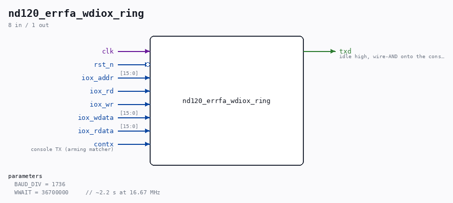

# nd120_errfa_wdiox_ring

Source: `Verilog/fpga/nexys4ddr/nd120_errfa_wdiox_ring.v`

<!-- Generated by Verilog/tests/module_doc.py from the //! comments in the source. Do not edit by hand - edit the RTL comments and regenerate. -->

<!-- HIERARCHY-NAV:BEGIN - written by Verilog/tests/gen_hierarchy.py, do not edit -->

**Hierarchy:** not instantiated by any of the 9 build tops (elaborated by yosys).

[Module hierarchy](../../../HIERARCHY.md) - [All modules](../../../MODULES.md)

<!-- HIERARCHY-NAV:END -->

## Description

ND120 Nexys 4 DDR - Winchester IOX ring for the ERRFA evidence probe
Captures the last 48 IOX accesses to the Winchester card (IOX
500-507): direction, register, and the data word (write data for a
write, the card's answer for a read, sampled at the end of the
strobe). Freezes when the console TX line spells "ERRFA" (SINTRAN's
own crash announcement - the same arming rule as the RAM-side probe)
and then prints the ring ONCE as
W R4 060005 W5 000105 ... <CR><LF>
(oldest first, R=read W=write, register digit, data in octal) on its
own 9600-baud TX, wire-ANDed onto the console by the top. The print
starts ~2.2 s after the match - after the RAM probe's P line
(~0.5-1.5 s) and the first EF line (~2.0 s), before the second EF
line (~4.1 s).
Purpose (24-AUG-2026): the SINTRAN `&` boot dies in the Winchester
driver with varying verdicts whose shared signature is device state
inconsistent within one driver pass. This ring shows the actual
register traffic - interleaved GO words, device clears, status
answers - at the moment of death.
Ronny Hansen

## Parameters

| Parameter | Default |
|---|---|
| `BAUD_DIV` | `1736` |
| `WWAIT` | `36700000     // ~2.2 s at 16.67 MHz` |

## Ports

| Direction | Width | Name | Description |
|---|---|---|---|
| input | `1` | `clk` |  |
| input | `1` | `rst_n` *(active low)* |  |
| input | `[15:0]` | `iox_addr` |  |
| input | `1` | `iox_rd` |  |
| input | `1` | `iox_wr` |  |
| input | `[15:0]` | `iox_wdata` |  |
| input | `[15:0]` | `iox_rdata` |  |
| input | `1` | `contx` | console TX (arming matcher) |
| output | `1` | `txd` | idle high, wire-AND onto the console |
