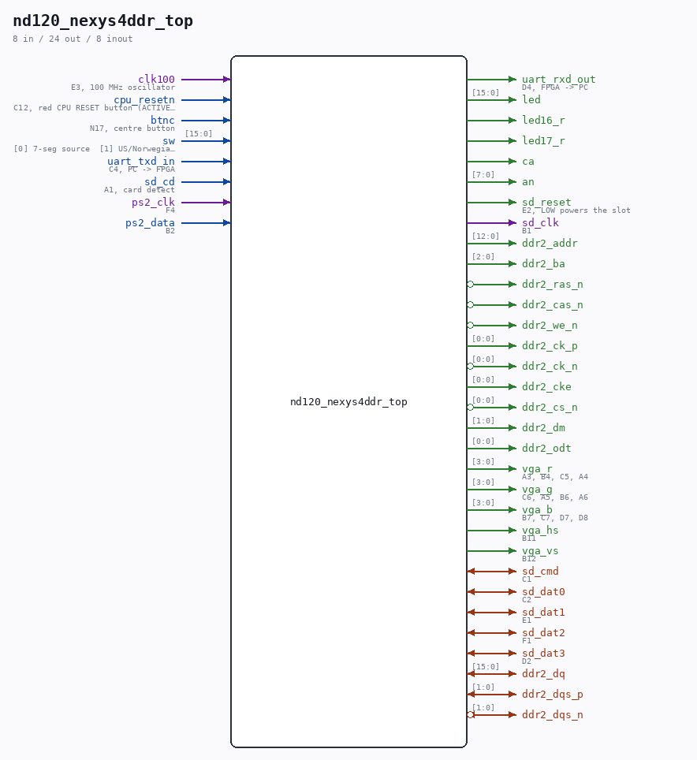

# nd120_nexys4ddr_top

Source: `Verilog/fpga/nexys4ddr/nd120_nexys4ddr_top.v`

> Generated by `Verilog/tests/module_doc.py` from the `//!`
> comments in the source. Do not edit by hand - edit the RTL comments and regenerate.

<!-- HIERARCHY-NAV:BEGIN - written by Verilog/tests/gen_hierarchy.py, do not edit -->

**Where it sits** (Nexys): **nd120_nexys4ddr_top**

**Used in:** nothing - this is a top (Nexys).

**Contains:** `BUFG` (vendor) x5, `BUFGMUX_CTRL` (vendor), [console_uart_rx](../../../Terminals/rtl/doc/console_uart_rx.md), [console_uart_tx](../../../Terminals/rtl/doc/console_uart_tx.md), [key_tdv2200](../../../Terminals/rtl/doc/key_tdv2200.md), [mips_counter](../../../Terminals/rtl/doc/mips_counter.md), `MMCME2_BASE` (vendor) x2, [ND120_CORE](../../../doc/ND120_CORE.md), [nd_ddr2_arb](../ddr2/doc/nd_ddr2_arb.md), [nd_ddr2_port](../ddr2/doc/nd_ddr2_port.md), [nd_ddr2_storage](../ddr2/doc/nd_ddr2_storage.md), [nd_storage_devices](../../../SD-FAT/circuit/doc/nd_storage_devices.md), [ps2_keyboard_tdv](../../../Terminals/rtl/doc/ps2_keyboard_tdv.md), [SevenSegDebug8](SevenSegDebug8.md), [term_console_feed](../../../Terminals/rtl/doc/term_console_feed.md), [terminal_top](../../../Terminals/rtl/doc/terminal_top.md)

[Module hierarchy](../../../HIERARCHY.md) - [All modules](../../../MODULES.md)

<!-- HIERARCHY-NAV:END -->

## Description

Nexys 4 DDR / Nexys A7-100T top level for the ND-120
Modelled on the Tang Nano 20K top (fpga/tang-nano-20k/src/
ND120_TANG20K_TOP.v): it instantiates ND120_CORE directly - not
ND120_TOP - because the ND-BUS device chain (papertape, floppy,
Winchester) only exists on the core, and hangs nd_storage_devices off
those seams so the devices are served from real images on the microSD
card.
DEVICES INCLUDED
TAPE-400   papertape at 400   - BOOT.TAP
FLOPPY     DMA floppy at 1560 - FLOPPY1.IMG / FLOPPY2.IMG
WINCHESTER ST506 disc at 500  - WD0.IMG / WD1.IMG
(SMD at 1540 is left out - Ronny asked for these three. On the Tang
SMD and Winchester are mutually exclusive for want of one BSRAM
block; this part has 135 tiles against the Tang's 46, so that
constraint does not apply here and SMD could be added later.)
STORAGE REGION - CACHED READS, WRITE THROUGH
nd_storage's Phase-4 tag directory (SD-FAT/circuit/nd_storage_cache.v)
uses a 4 MB region as a CACHE of arbitrarily large images: the disc
classes are cached, tape and floppy go direct to the card, and writes
go through to the card. Same behaviour as the Tang.
WHERE the region lives is the board difference. The Tang has one SDRAM
chip shared with CPU main memory, so its region is reached through
MEM_RAM_49_SDRAM's ND_STORAGE_PORT. Here main memory is BRAM and the
DDR2 is otherwise unused, so the region connects straight to
ddr2/nd_ddr2_port.v through ddr2/nd_ddr2_storage.v - no detour through
the CPU memory path. When main memory later moves into DDR2,
nd_ddr2_port is where the two clients get arbitrated.
CLOCKS - one MMCM, VCO 1000 MHz from the 100 MHz oscillator:
clk_cpu   1000/60 = 16.667 MHz  CPU, bus, OSC and the device chain
clk_stor  1000/37 = 27.027 MHz  SD/FAT stack, at its proven divisors
clk200    1000/5  = 200 MHz     the DDR2 controller's input
The three are declared asynchronous in build.tcl; every crossing is a
two-flop synchroniser or a toggle handshake.
MAIN MEMORY is DDR2 with a BRAM cache in front (MAIN_RAM_DDR2, default
since 25-AUG-2026): MEM_RAM_49_DDR2 inside MEM_43 reaches the MIG
through nd_ddr2_arb, sharing it with the storage region. The old
BRAM-only configuration is kept behind build.tcl -tclargs bramram.
Build: vivado -mode batch -source build.tcl   (see README.md)
Last reviewed: 20-AUG-2026
Ronny Hansen

## Ports

| Direction | Width | Name | Description |
|---|---|---|---|
| input | `1` | `clk100` | E3, 100 MHz oscillator |
| input | `1` | `cpu_resetn` | C12, red CPU RESET button (ACTIVE LOW) |
| input | `1` | `btnc` | N17, centre button |
| input | `[15:0]` | `sw` | [0] 7-seg source  [1] US/Norwegian  [3] operator panel  [4] cache OFF  [7] console 9600 baud |
| input | `1` | `uart_txd_in` | C4, PC -> FPGA |
| output | `1` | `uart_rxd_out` | D4, FPGA -> PC |
| output | `[15:0]` | `led` |  |
| output | `1` | `led16_r` |  |
| output | `1` | `led17_r` |  |
| output | `1` | `ca` |  |
| output | `[7:0]` | `an` |  |
| output | `1` | `sd_reset` | E2, LOW powers the slot |
| input | `1` | `sd_cd` | A1, card detect |
| output | `1` | `sd_clk` | B1 |
| inout | `1` | `sd_cmd` | C1 |
| inout | `1` | `sd_dat0` | C2 |
| inout | `1` | `sd_dat1` | E1 |
| inout | `1` | `sd_dat2` | F1 |
| inout | `1` | `sd_dat3` | D2 |
| inout | `[15:0]` | `ddr2_dq` |  |
| inout | `[1:0]` | `ddr2_dqs_p` |  |
| inout | `[1:0]` | `ddr2_dqs_n` *(active low)* |  |
| output | `[12:0]` | `ddr2_addr` |  |
| output | `[2:0]` | `ddr2_ba` |  |
| output | `1` | `ddr2_ras_n` *(active low)* |  |
| output | `1` | `ddr2_cas_n` *(active low)* |  |
| output | `1` | `ddr2_we_n` *(active low)* |  |
| output | `[0:0]` | `ddr2_ck_p` |  |
| output | `[0:0]` | `ddr2_ck_n` *(active low)* |  |
| output | `[0:0]` | `ddr2_cke` |  |
| output | `[0:0]` | `ddr2_cs_n` *(active low)* |  |
| output | `[1:0]` | `ddr2_dm` |  |
| output | `[0:0]` | `ddr2_odt` |  |
| output | `[3:0]` | `vga_r` | A3, B4, C5, A4 |
| output | `[3:0]` | `vga_g` | C6, A5, B6, A6 |
| output | `[3:0]` | `vga_b` | B7, C7, D7, D8 |
| output | `1` | `vga_hs` | B11 |
| output | `1` | `vga_vs` | B12 |
| input | `1` | `ps2_clk` | F4 |
| input | `1` | `ps2_data` | B2 |
