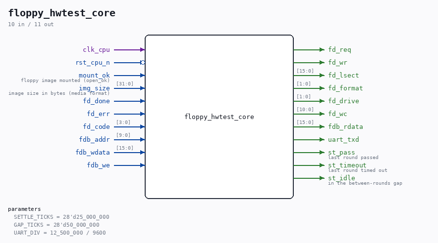

# floppy_hwtest_core

Source: `Verilog/fpga/nexys4ddr/floppy-hw-test/floppy_hwtest_core.v`

> Generated by `Verilog/tests/module_doc.py` from the `//!`
> comments in the source. Do not edit by hand - edit the RTL comments and regenerate.

<!-- HIERARCHY-NAV:BEGIN - written by Verilog/tests/gen_hierarchy.py, do not edit -->

**Hierarchy:** not instantiated by any of the 9 build tops (elaborated by yosys).

[Module hierarchy](../../../../HIERARCHY.md) - [All modules](../../../../MODULES.md)

<!-- HIERARCHY-NAV:END -->

## Description

floppy_hwtest_core - the self-checking floppy DMA hardware test proper:
ND_FLOPPY_DMA + ND_DMA_MASTER + block-RAM main memory answering the
ND-bus handshake + the CPU-fetch CONTENTION INJECTOR + the IOX driver
FSM + checksum + UART printer. Board-independent: floppy_hwtest_top
wires it to the real SD storage adapter on the Nexys 4 DDR; the
testbench (sim/floppy_hwtest_core_tb.v) wires it to a fake disk
backend. See the header of floppy_hwtest_top.v for the output format
and golden values.
Ronny Hansen

## Parameters

| Parameter | Default |
|---|---|
| `SETTLE_TICKS` | `28'd25_000_000` |
| `GAP_TICKS` | `28'd50_000_000` |
| `UART_DIV` | `12_500_000 / 9600` |

## Ports

| Direction | Width | Name | Description |
|---|---|---|---|
| input | `1` | `clk_cpu` |  |
| input | `1` | `rst_cpu_n` *(active low)* |  |
| input | `1` | `mount_ok` | floppy image mounted (open_ok) |
| input | `[31:0]` | `img_size` | image size in bytes (media format) |
| output | `1` | `fd_req` |  |
| output | `1` | `fd_wr` |  |
| output | `[15:0]` | `fd_lsect` |  |
| output | `[1:0]` | `fd_format` |  |
| output | `[1:0]` | `fd_drive` |  |
| output | `[10:0]` | `fd_wc` |  |
| input | `1` | `fd_done` |  |
| input | `1` | `fd_err` |  |
| input | `[3:0]` | `fd_code` |  |
| input | `[9:0]` | `fdb_addr` |  |
| input | `[15:0]` | `fdb_wdata` |  |
| input | `1` | `fdb_we` |  |
| output | `[15:0]` | `fdb_rdata` |  |
| output | `1` | `uart_txd` |  |
| output | `1` | `st_pass` | last round passed |
| output | `1` | `st_timeout` | last round timed out |
| output | `1` | `st_idle` | in the between-rounds gap |
