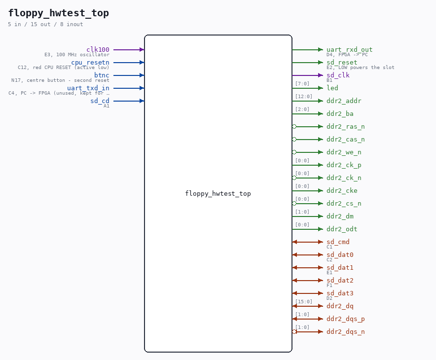

# floppy_hwtest_top

Source: `Verilog/fpga/nexys4ddr/floppy-hw-test/floppy_hwtest_top.v`

> Generated by `Verilog/tests/module_doc.py` from the `//!`
> comments in the source. Do not edit by hand - edit the RTL comments and regenerate.

<!-- HIERARCHY-NAV:BEGIN - written by Verilog/tests/gen_hierarchy.py, do not edit -->

**Hierarchy:** not instantiated by any of the 9 build tops (elaborated by yosys).

[Module hierarchy](../../../../HIERARCHY.md) - [All modules](../../../../MODULES.md)

<!-- HIERARCHY-NAV:END -->

## Description

floppy_hwtest_top - SELF-CHECKING VERILOG TEST PROGRAM ON THE REAL
NEXYS 4 DDR HARDWARE for the floppy DMA path (root cause + fix:
../HANDOFF-floppy-dma-investigation.md PART 0, retired - git c4896a4).
WHAT IT CONTAINS - the real RTL under test, no CPU:
ND_FLOPPY_DMA (the floppy controller)
ND_DMA_MASTER (the bus master whose read capture had the fault)
nd_storage + nd_storage_floppy_adapter + DDR2 + real SD card
a block-RAM main memory answering the real ND-bus handshake
a CONTENTION INJECTOR: before every memory read answer it drives
two clock ticks of a rotating "CPU instruction fetch" word onto
the shared BD lines - the exact flicker measured on the failing
system (165562 = IOX 1562 etc.). This is what the CPU's polling
loop does on the real board; without it a zero-word read cannot
corrupt and the test would prove nothing.
WHAT IT DOES, forever, ~ every 4 s: an FSM emulates the CPU's IOX
accesses - preseeds memory, writes the 12-word command block at 3000
(octal; READ fmt 3, diskAddress 0, WORD-COUNT mode 1024 words, target
20000 octal - the exact first operation of the 1560& boot), kicks IOX
1565/1567/1563, polls IOX 1562 for ready, then checksums ALL 1024
transferred words in hardware and prints on the UART (9600 8N1):
S ssssss E eeeeee F ffffff B b0 b1 b2 b3 C cccccc P
(same field layout as tests/floppy-dma-test; P = HW-PASS, F = HW-FAIL,
T = timeout). Golden values from the nd100x oracle:
S 1000x0  E 000010  F 000000  B 000060 000057 000062 000015
C 125441
PASS requires: not timed out, error code bits 14:9 of E all zero,
B0 = 000060, checksum = 125441. On the PRE-FIX ND_DMA_MASTER this
test FAILS (the injector corrupts the zero-valued command-block words
exactly as the CPU did); on the fixed RTL it PASSES.
Ronny Hansen

## Ports

| Direction | Width | Name | Description |
|---|---|---|---|
| input | `1` | `clk100` | E3, 100 MHz oscillator |
| input | `1` | `cpu_resetn` | C12, red CPU RESET (active low) |
| input | `1` | `btnc` | N17, centre button - second reset |
| input | `1` | `uart_txd_in` | C4, PC -> FPGA (unused, kept for the pinout) |
| output | `1` | `uart_rxd_out` | D4, FPGA -> PC |
| output | `1` | `sd_reset` | E2, LOW powers the slot |
| input | `1` | `sd_cd` | A1 |
| output | `1` | `sd_clk` | B1 |
| inout | `1` | `sd_cmd` | C1 |
| inout | `1` | `sd_dat0` | C2 |
| inout | `1` | `sd_dat1` | E1 |
| inout | `1` | `sd_dat2` | F1 |
| inout | `1` | `sd_dat3` | D2 |
| output | `[7:0]` | `led` |  |
| inout | `[15:0]` | `ddr2_dq` |  |
| inout | `[1:0]` | `ddr2_dqs_p` |  |
| inout | `[1:0]` | `ddr2_dqs_n` *(active low)* |  |
| output | `[12:0]` | `ddr2_addr` |  |
| output | `[2:0]` | `ddr2_ba` |  |
| output | `1` | `ddr2_ras_n` *(active low)* |  |
| output | `1` | `ddr2_cas_n` *(active low)* |  |
| output | `1` | `ddr2_we_n` *(active low)* |  |
| output | `[0:0]` | `ddr2_ck_p` |  |
| output | `[0:0]` | `ddr2_ck_n` *(active low)* |  |
| output | `[0:0]` | `ddr2_cke` |  |
| output | `[0:0]` | `ddr2_cs_n` *(active low)* |  |
| output | `[1:0]` | `ddr2_dm` |  |
| output | `[0:0]` | `ddr2_odt` |  |
