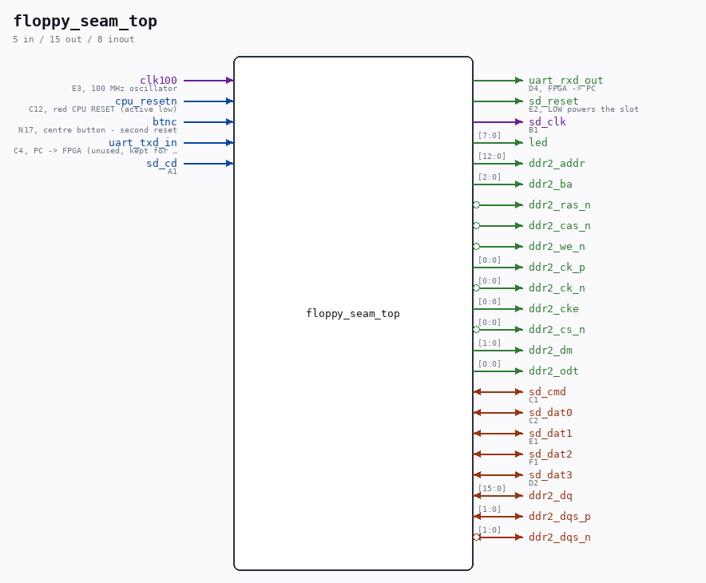

# floppy_seam_top

Source: `Verilog/fpga/nexys4ddr/floppy-seam-test/floppy_seam_top.v`

<!-- Generated by Verilog/tests/module_doc.py from the //! comments in the source. Do not edit by hand - edit the RTL comments and regenerate. -->

<!-- HIERARCHY-NAV:BEGIN - written by Verilog/tests/gen_hierarchy.py, do not edit -->

**Hierarchy:** not instantiated by any of the 9 build tops (elaborated by yosys).

[Module hierarchy](../../../../HIERARCHY.md) - [All modules](../../../../MODULES.md)

<!-- HIERARCHY-NAV:END -->

## Description

floppy_seam_top - autonomous silicon probe for the Nexys 4 DDR floppy
seam fault (see ../HANDOFF-floppy-dma-investigation.md, retired -
git c4896a4).
WHAT IT IS: the EXACT storage configuration of the ND-120 top
(nd120_nexys4ddr_top.v) - nd_storage at the same parameters, the same
MMCM clocks (clk_cpu 12.5 MHz, clk_stor 27.027 MHz, DDR2 ui 75 MHz),
the same nd_ddr2_storage/nd_ddr2_port region, the real SD card - but
with the CPU replaced by a reporter FSM that owns the UART (9600 8N1)
and prints, in an endless ~2 s loop:
S=s O=hh E=hh Z0=xxxxxxxx Z1=xxxxxxxx Z6=xxxxxxxx
R0=ec wwww wwww     (FDISK read sector 0, fmt 3, 512 words:
R1=ec wwww wwww      e=err flag, c=err code, then device-buffer
R2=ec wwww wwww      words 0 and 1)
R3=ec wwww wwww
so the open question "does the clk_cpu side see size_bytes = 0 for the
floppy client, and why is a sector-0 read answered RANGE" is measured
with no buttons, switches or eyes - build, JTAG-program, read the UART.
The floppy path uses the REAL nd_storage_floppy_adapter on client 1,
driven exactly like ND_FLOPPY_DMA drives it. Clients 0 (BOOT.TAP) and
6 (WD0.IMG) are opened the same way the devices wrapper opens them, so
the mount sequence matches the ND-120 build.
Ronny Hansen

## Ports

| Direction | Width | Name | Description |
|---|---|---|---|
| input | `1` | `clk100` | E3, 100 MHz oscillator |
| input | `1` | `cpu_resetn` | C12, red CPU RESET (active low) |
| input | `1` | `btnc` | N17, centre button - second reset |
| input | `1` | `uart_txd_in` | C4, PC -> FPGA (unused, kept for the pinout) |
| output | `1` | `uart_rxd_out` | D4, FPGA -> PC |
| output | `1` | `sd_reset` | E2, LOW powers the slot |
| input | `1` | `sd_cd` | A1 |
| output | `1` | `sd_clk` | B1 |
| inout | `1` | `sd_cmd` | C1 |
| inout | `1` | `sd_dat0` | C2 |
| inout | `1` | `sd_dat1` | E1 |
| inout | `1` | `sd_dat2` | F1 |
| inout | `1` | `sd_dat3` | D2 |
| output | `[7:0]` | `led` |  |
| inout | `[15:0]` | `ddr2_dq` |  |
| inout | `[1:0]` | `ddr2_dqs_p` |  |
| inout | `[1:0]` | `ddr2_dqs_n` *(active low)* |  |
| output | `[12:0]` | `ddr2_addr` |  |
| output | `[2:0]` | `ddr2_ba` |  |
| output | `1` | `ddr2_ras_n` *(active low)* |  |
| output | `1` | `ddr2_cas_n` *(active low)* |  |
| output | `1` | `ddr2_we_n` *(active low)* |  |
| output | `[0:0]` | `ddr2_ck_p` |  |
| output | `[0:0]` | `ddr2_ck_n` *(active low)* |  |
| output | `[0:0]` | `ddr2_cke` |  |
| output | `[0:0]` | `ddr2_cs_n` *(active low)* |  |
| output | `[1:0]` | `ddr2_dm` |  |
| output | `[0:0]` | `ddr2_odt` |  |
