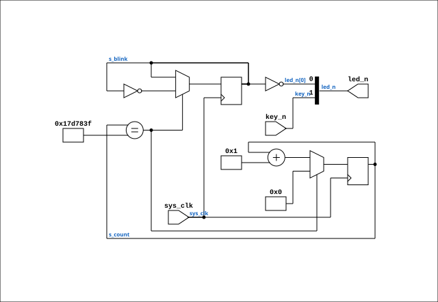

# led_test_top

Source: `Verilog/fpga/qmtech-a35t/led-test/led_test_top.v`

<!-- Generated by Verilog/tests/module_doc.py from the //! comments in the source. Do not edit by hand - edit the RTL comments and regenerate. -->

<!-- HIERARCHY-NAV:BEGIN - written by Verilog/tests/gen_hierarchy.py, do not edit -->

**Hierarchy:** not instantiated by any of the 9 build tops (elaborated by yosys).

[Module hierarchy](../../../../HIERARCHY.md) - [All modules](../../../../MODULES.md)

<!-- HIERARCHY-NAV:END -->


<!-- SCHEMATIC:BEGIN - written by Verilog/tests/gen_schematics.py, do not edit -->

## Schematic

Drawn from the Verilog: no build top uses this module, so it was elaborated from its own file with no defines and default parameters. Sub-modules are boxes (click the picture to open it full size; there every sub-module box links to its page, and every wire shows its Verilog name).

[](led_test_top.svg)

<!-- SCHEMATIC:END -->

## Parameters

| Parameter | Default |
|---|---|
| `CLK_FREQ` | `50_000_000   // R2 crystal` |

## Ports

| Direction | Width | Name | Description |
|---|---|---|---|
| input | `1` | `sys_clk` |  |
| input | `1` | `key_n` *(active low)* | user key, active-low (4.7k pull-up) |
| output | `[1:0]` | `led_n` *(active low)* | user LEDs, active-low (0 = lit) |

## Verilog source

[`Verilog/fpga/qmtech-a35t/led-test/led_test_top.v`](https://github.com/RetroCoreLabs/nd-120/blob/main/Verilog/fpga/qmtech-a35t/led-test/led_test_top.v) on GitHub.

<details markdown="1">
<summary>Show the Verilog of led_test_top (38 lines)</summary>

```verilog
// ============================================================================
// QMTECH XC7A35T core board - stage-1 LED smoke test
//
// Proves the bring-up basics end to end:
//   - Platform Cable USB II programming path (build.tcl programs over JTAG)
//   - 50 MHz crystal on R2 is alive          -> led_n[0] blinks at 1 Hz
//   - both user LEDs drivable (active-low)   -> led_n[1] on while key held
//   - user key on H18 reachable (active-low)
//
// All time counts derive from CLK_FREQ (lesson from the OPCOM RTC bug:
// never hard-code cycle counts for one board's clock).
// ============================================================================
module led_test_top #(
    parameter CLK_FREQ = 50_000_000   // R2 crystal, Hz
) (
    input  wire       sys_clk,
    input  wire       key_n,     // user key, active-low (4.7k pull-up)
    output wire [1:0] led_n      // user LEDs, active-low (0 = lit)
);

    localparam HALF_PERIOD = CLK_FREQ / 2;   // 1 Hz blink = 0.5 s per phase

    reg [31:0] s_count = 32'd0;
    reg        s_blink = 1'b0;

    always @(posedge sys_clk) begin
        if (s_count == HALF_PERIOD - 1) begin
            s_count <= 32'd0;
            s_blink <= ~s_blink;
        end else begin
            s_count <= s_count + 32'd1;
        end
    end

    assign led_n[0] = ~s_blink;   // heartbeat: lit half the time
    assign led_n[1] = key_n;      // key pressed (low) -> LED lit

endmodule
```

</details>
