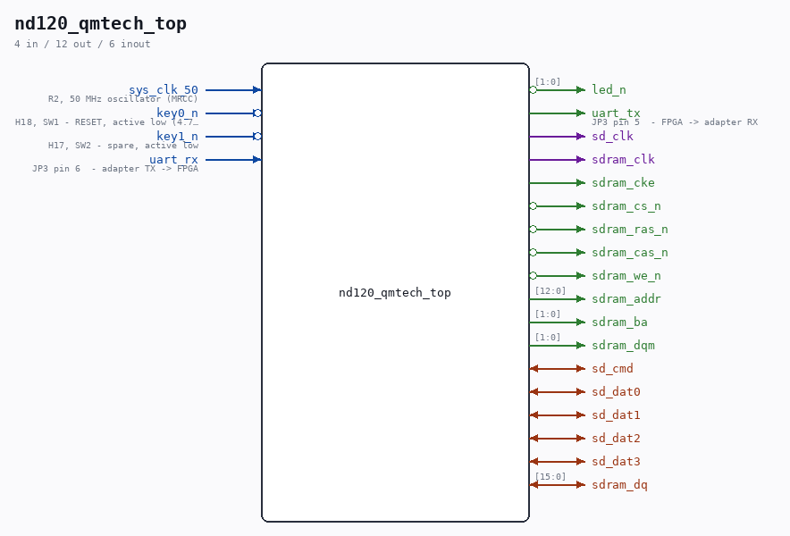

# nd120_qmtech_top

Source: `Verilog/fpga/qmtech-a35t/rtl/nd120_qmtech_top.v`

<!-- Generated by Verilog/tests/module_doc.py from the //! comments in the source. Do not edit by hand - edit the RTL comments and regenerate. -->

<!-- HIERARCHY-NAV:BEGIN - written by Verilog/tests/gen_hierarchy.py, do not edit -->

**Where it sits** (QMTECH): **nd120_qmtech_top**

**Used in:** nothing - this is a top (QMTECH).

**Contains:** `BUFG` (vendor) x5, `MMCME2_BASE` (vendor), [ND120_CORE](../../../../doc/ND120_CORE.md), [nd_storage_bram](nd_storage_bram.md), [nd_storage_devices](../../../../SD-FAT/circuit/doc/nd_storage_devices.md)

[Module hierarchy](../../../../HIERARCHY.md) - [All modules](../../../../MODULES.md)

<!-- HIERARCHY-NAV:END -->

## Description

QMTECH XC7A35T SDRAM core board - ND-120 top level
Full path: Verilog/fpga/qmtech-a35t/rtl/nd120_qmtech_top.v
Written 04-SEP-2026. NOT YET BUILT OR RUN ON HARDWARE.
WHAT THIS BOARD IS FOR
The same XC7A35T die as the Basys3, but with a 32 MB SDRAM chip beside
it. The Basys3 cannot run SINTRAN for want of memory - 100 RAMB18 gives
24 KB of main store - and that is a capacity limit no clock speed
fixes. This board removes it.
SHAPE OF THE BUILD
Modelled on fpga/mega65/rtl/nd120_mega65_machine.v (the same CPU core
and the same 16-bit SDRAM bridge mode, on the same Artix-7 fabric and
the same Vivado flow) with the card-side storage taken from the Tang
top (fpga/tang-nano-20k/src/ND120_TANG20K_TOP.v). It instantiates
ND120_CORE rather than ND120_TOP because the ND-BUS device chain -
papertape, floppy, Winchester - exists only on the core.
MAIN MEMORY: 4 MB, the board's W9825G6KH-6 through the sheet-49 bridge
(MEM_RAM_49_SDRAM + sdram18) in its 16-BIT module mode, ND_SDRAM_PACK16
+ ND_SDRAM_DQ16. That is the configuration that boots SINTRAN on the
MiSTer and builds timing-clean for the MEGA65 R6; this chip is 16 bits
wide like the DE10-Nano module, so it needs the same mode. The mode
maps 2M words as BANK0 + BANK2, which is the whole of the ND-120's
onboard memory space: the CPU board's own decode puts onboard memory in
the bottom 2M words (PAL_44445B.v:85), so the other 28 MB of the chip
could not be addressed as main store however it were wired.
REFRESH: this chip has 8192 rows and needs an auto-refresh every 7.8 us
at most, so the build sets ND_SDRAM_REFRESH_US=7 - the same value the
MiSTer uses for the same reason. The bridge's 15 us default suits the
Tang's 2K-row die and would UNDER-refresh this one.
STORAGE: SD card on the header, images served by nd_storage_devices,
every client DIRECT (uncached). The region behind its mem_* port is a
block RAM here (rtl/nd_storage_bram.v) rather than a slice of the
SDRAM, because the 16-bit bridge mode has no working 32-bit access and
the SDRAM device port needs one - the long version of that is in the
header of nd_storage_bram.v. Uncached is a proven configuration, not a
stopgap that has never run: the Tang served every disc that way for
weeks, and the 23-AUG-2026 experiment measured no functional difference
between cache on, cache masked off, and cache not synthesized. It costs
speed, not function. Restoring the cache means teaching the 16-bit mode
a two-beat 32-bit access; until then this build must be compiled with
ND_STORAGE_NO_CACHE (build.tcl passes it).
CONSOLE: the CPU's own serial pins, straight out to two header pins for
a 3.3 V USB-serial adapter. 115200. There is no terminal core and no
video on this board, so the glyphs are the PC terminal's problem. The
board has NO on-board USB-UART - the Mini USB socket is power only.
CLOCKS - one MMCM, VCO 1000 MHz from the 50 MHz oscillator:
clk_cpu       1000/50 = 20.000 MHz  CPU, bus, OSC, the device chain
clk2x         1000/25 = 40.000 MHz  the SDRAM bridge
clk2x_sdram   1000/25 = 40.000 MHz at 180 degrees, to the chip's pin
clk_stor      1000/37 = 27.027 MHz  the SD/FAT stack
clk2x is an exact integer 2x of clk_cpu off the same VCO, which is what
the bridge's "same PLL, edge-aligned" rule requires. clk_stor is 27 MHz
because the SD identification clock has to land in the card's legal
100-400 kHz window after the stack's own divisor, exactly as on the
Tang and the Nexys - it is NOT a free choice.
Ronny Hansen

## Ports

| Direction | Width | Name | Description |
|---|---|---|---|
| input | `1` | `sys_clk_50` | R2, 50 MHz oscillator (MRCC) |
| input | `1` | `key0_n` *(active low)* | H18, SW1 - RESET, active low (4.7k pull-up) |
| input | `1` | `key1_n` *(active low)* | H17, SW2 - spare, active low |
| output | `[1:0]` | `led_n` *(active low)* |  |
| input | `1` | `uart_rx` | JP3 pin 6  - adapter TX -> FPGA |
| output | `1` | `uart_tx` | JP3 pin 5  - FPGA -> adapter RX |
| output | `1` | `sd_clk` |  |
| inout | `1` | `sd_cmd` |  |
| inout | `1` | `sd_dat0` |  |
| inout | `1` | `sd_dat1` |  |
| inout | `1` | `sd_dat2` |  |
| inout | `1` | `sd_dat3` |  |
| output | `1` | `sdram_clk` |  |
| output | `1` | `sdram_cke` |  |
| output | `1` | `sdram_cs_n` *(active low)* |  |
| output | `1` | `sdram_ras_n` *(active low)* |  |
| output | `1` | `sdram_cas_n` *(active low)* |  |
| output | `1` | `sdram_we_n` *(active low)* |  |
| output | `[12:0]` | `sdram_addr` |  |
| output | `[1:0]` | `sdram_ba` |  |
| output | `[1:0]` | `sdram_dqm` |  |
| inout | `[15:0]` | `sdram_dq` |  |
