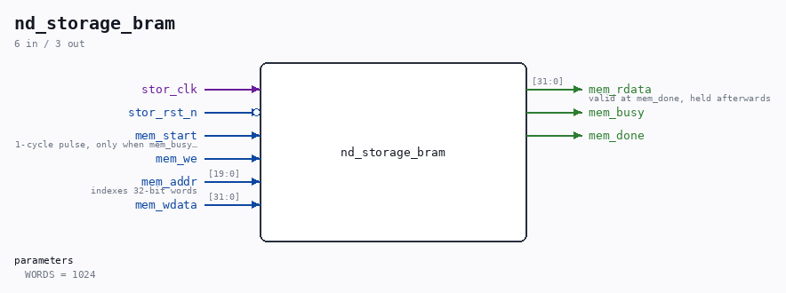
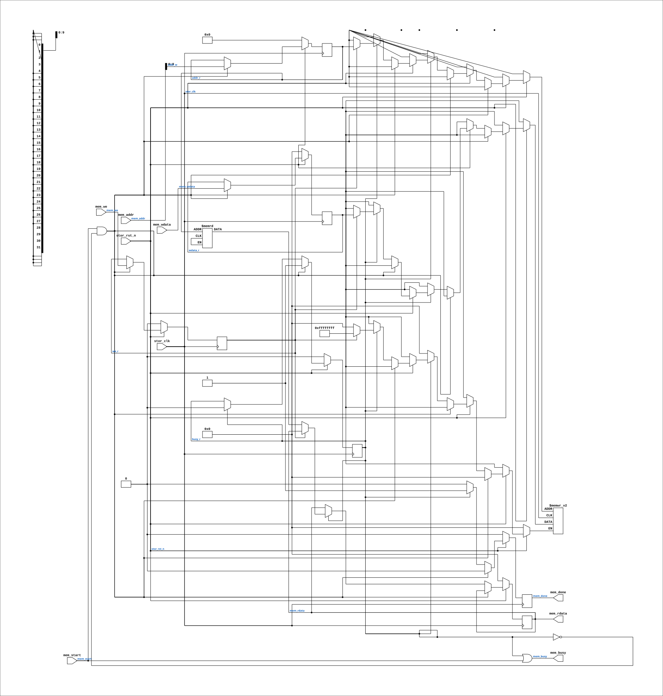

# nd_storage_bram

Source: `Verilog/fpga/qmtech-a35t/rtl/nd_storage_bram.v`

<!-- Generated by Verilog/tests/module_doc.py from the //! comments in the source. Do not edit by hand - edit the RTL comments and regenerate. -->

<!-- HIERARCHY-NAV:BEGIN - written by Verilog/tests/gen_hierarchy.py, do not edit -->

**Where it sits** (QMTECH): [nd120_qmtech_top](nd120_qmtech_top.md) > **nd_storage_bram**
- instance path: `STORAGE_REGION`

**Used in:** [nd120_qmtech_top](nd120_qmtech_top.md) (QMTECH)

**Contains:** no other modules.

[Module hierarchy](../../../../HIERARCHY.md) - [All modules](../../../../MODULES.md)

<!-- HIERARCHY-NAV:END -->



<!-- SCHEMATIC:BEGIN - written by Verilog/tests/gen_schematics.py, do not edit -->

## Schematic

Drawn from the Verilog: the yosys netlist of the QMTECH XC7A35T build, instance `STORAGE_REGION`. Sub-modules are boxes (click the picture to open it full size; there every sub-module box links to its page, and every wire shows its Verilog name).

[](nd_storage_bram.svg)

<!-- SCHEMATIC:END -->

## Description

nd_storage_bram - the nd_storage region, held in block RAM
Full path: Verilog/fpga/qmtech-a35t/rtl/nd_storage_bram.v
WHY THIS EXISTS
nd_storage needs a REGION of block storage behind its mem_* port. On
the Tang that region is the upper half of the SDRAM chip (reached via
MEM_RAM_49_SDRAM's ND_STORAGE_PORT); on the Nexys it is DDR2 (via
nd_ddr2_storage.v). Neither is available here, because this board runs
the SDRAM bridge in its 16-BIT module mode (ND_SDRAM_DQ16) and that
mode has no working 32-bit full-location access: sdram18.v's DQ16
branch writes din_buf and ignores acc32 entirely (sdram18.v:269-270,
and the header note at sdram18.v:36 says so in as many words). The
ND_STORAGE_PORT path in MEM_RAM_49_SDRAM drives acc32=1 on every device
access (MEM_RAM_49_SDRAM.v:465,545,568), so the two features cannot be
combined as the code stands. Nobody hit this before because the two
boards that use DQ16 (MiSTer, MEGA65) get their disc images from the
host side instead of from a card.
WHAT MAKES A BLOCK RAM ENOUGH
The region is only large when the Phase-4 tag directory uses it as a
CACHE. With every client DIRECT (CACHE_MASK = 0, which is what
ND_STORAGE_DISCS_UNCACHED / ND_STORAGE_NO_CACHE select) the region
holds exactly ONE shared staging line at STAGE_BASE_BLK, because the
arbiter serves one client at a time and a DIRECT line never has to
survive past its own operation (nd_storage.v:83-87). One block is 2048
bytes = 512 words of 32 bits, so the whole region fits in a single
RAMB36. Image size is NOT limited by this: under Phase 4 a DIRECT
client fetches every request from the card, so a 75 MB WD0.IMG is
served through the same 2 KB line.
DEPTH is 1024 words (two blocks) rather than the 512 that a
stage-only build touches - one RAMB36 holds it either way, and the
margin means a build that later sets STAGE_BASE_BLK or POOL_BASE_BLK to
block 1 does not silently address past the end.
THE PORT CONTRACT (from nd_storage_engine.v; identical wording to
fpga/nexys4ddr/ddr2/nd_ddr2_storage.v so the two can be compared)
mem_start  1-cycle pulse, only legal while mem_busy = 0
mem_we / mem_addr / mem_wdata  stable from mem_start until mem_done
mem_rdata  valid at mem_done and held afterwards
mem_busy   level, high for the whole operation
mem_done   1-cycle pulse
ONE CLOCK DOMAIN. The DDR2 and SDRAM backends both cross into a faster
controller clock and need a toggle handshake; the block RAM sits in the
storage domain itself, so there is no crossing and no handshake here.
Every access is a fixed 2 cycles.
Written 04-SEP-2026 for the QMTECH XC7A35T bring-up.
Ronny Hansen

## Parameters

| Parameter | Default |
|---|---|
| `WORDS` | `1024` |

## Ports

| Direction | Width | Name | Description |
|---|---|---|---|
| input | `1` | `stor_clk` |  |
| input | `1` | `stor_rst_n` *(active low)* |  |
| input | `1` | `mem_start` | 1-cycle pulse, only when mem_busy = 0 |
| input | `1` | `mem_we` |  |
| input | `[19:0]` | `mem_addr` | indexes 32-bit words |
| input | `[31:0]` | `mem_wdata` |  |
| output | `[31:0]` | `mem_rdata` | valid at mem_done, held afterwards |
| output | `1` | `mem_busy` |  |
| output | `1` | `mem_done` |  |

## Verilog source

[`Verilog/fpga/qmtech-a35t/rtl/nd_storage_bram.v`](https://github.com/RetroCoreLabs/nd-120/blob/main/Verilog/fpga/qmtech-a35t/rtl/nd_storage_bram.v) on GitHub.

<details markdown="1">
<summary>Show the Verilog of nd_storage_bram (144 lines)</summary>

```verilog
/****************************************************************************
** nd_storage_bram - the nd_storage region, held in block RAM              **
**                                                                         **
** Full path: Verilog/fpga/qmtech-a35t/rtl/nd_storage_bram.v               **
**                                                                         **
** WHY THIS EXISTS                                                          **
** nd_storage needs a REGION of block storage behind its mem_* port. On    **
** the Tang that region is the upper half of the SDRAM chip (reached via   **
** MEM_RAM_49_SDRAM's ND_STORAGE_PORT); on the Nexys it is DDR2 (via       **
** nd_ddr2_storage.v). Neither is available here, because this board runs  **
** the SDRAM bridge in its 16-BIT module mode (ND_SDRAM_DQ16) and that     **
** mode has no working 32-bit full-location access: sdram18.v's DQ16       **
** branch writes din_buf and ignores acc32 entirely (sdram18.v:269-270,    **
** and the header note at sdram18.v:36 says so in as many words). The      **
** ND_STORAGE_PORT path in MEM_RAM_49_SDRAM drives acc32=1 on every device **
** access (MEM_RAM_49_SDRAM.v:465,545,568), so the two features cannot be  **
** combined as the code stands. Nobody hit this before because the two     **
** boards that use DQ16 (MiSTer, MEGA65) get their disc images from the    **
** host side instead of from a card.                                       **
**                                                                         **
** WHAT MAKES A BLOCK RAM ENOUGH                                            **
** The region is only large when the Phase-4 tag directory uses it as a    **
** CACHE. With every client DIRECT (CACHE_MASK = 0, which is what          **
** ND_STORAGE_DISCS_UNCACHED / ND_STORAGE_NO_CACHE select) the region      **
** holds exactly ONE shared staging line at STAGE_BASE_BLK, because the    **
** arbiter serves one client at a time and a DIRECT line never has to      **
** survive past its own operation (nd_storage.v:83-87). One block is 2048  **
** bytes = 512 words of 32 bits, so the whole region fits in a single      **
** RAMB36. Image size is NOT limited by this: under Phase 4 a DIRECT       **
** client fetches every request from the card, so a 75 MB WD0.IMG is       **
** served through the same 2 KB line.                                      **
**                                                                         **
** DEPTH is 1024 words (two blocks) rather than the 512 that a             **
** stage-only build touches - one RAMB36 holds it either way, and the      **
** margin means a build that later sets STAGE_BASE_BLK or POOL_BASE_BLK to **
** block 1 does not silently address past the end.                         **
**                                                                         **
** THE PORT CONTRACT (from nd_storage_engine.v; identical wording to       **
** fpga/nexys4ddr/ddr2/nd_ddr2_storage.v so the two can be compared)       **
**   mem_start  1-cycle pulse, only legal while mem_busy = 0               **
**   mem_we / mem_addr / mem_wdata  stable from mem_start until mem_done   **
**   mem_rdata  valid at mem_done and held afterwards                      **
**   mem_busy   level, high for the whole operation                        **
**   mem_done   1-cycle pulse                                              **
**                                                                         **
** ONE CLOCK DOMAIN. The DDR2 and SDRAM backends both cross into a faster  **
** controller clock and need a toggle handshake; the block RAM sits in the **
** storage domain itself, so there is no crossing and no handshake here.   **
** Every access is a fixed 2 cycles.                                       **
**                                                                         **
** Written 04-SEP-2026 for the QMTECH XC7A35T bring-up.                    **
** Ronny Hansen                                                            **
*****************************************************************************/
`default_nettype none

module nd_storage_bram #(
    //! Region depth in 32-bit words. 512 = one 2048-byte block, which is all
    //! an all-DIRECT build touches. 1024 = two blocks, still one RAMB36.
    parameter integer WORDS = 1024
) (
    input  wire        stor_clk,
    input  wire        stor_rst_n,

    input  wire        mem_start,   //! 1-cycle pulse, only when mem_busy = 0
    input  wire        mem_we,
    input  wire [19:0] mem_addr,    //! indexes 32-bit words
    input  wire [31:0] mem_wdata,
    output reg  [31:0] mem_rdata,   //! valid at mem_done, held afterwards
    output wire        mem_busy,
    output reg         mem_done
);

  // Address width for WORDS entries. $clog2 is 1364-2005 and Vivado, iverilog
  // and Verilator all accept it in a localparam.
  localparam integer AW = $clog2(WORDS);

  // The region itself. ram_style="block" forces a RAMB rather than letting
  // Vivado spread 1024x32 across LUT RAM, which would cost ~2000 LUTs on a
  // part where LUTs are the scarce resource and block RAM is not.
  (* ram_style = "block" *)
  reg [31:0] region[0:WORDS-1];

  // Access is a fixed two cycles: the start pulse latches the request, and
  // the cycle after it the RAM is touched once - a write commits, a read
  // registers its word out with mem_done. Holding busy across both cycles is
  // what keeps the caller from issuing a second start into the middle of
  // this one.
  //
  // Both the write and the read address the array through the SAME registered
  // address, addr_r. Using the combinational address for the write and the
  // registered one for the read would give the array two address expressions,
  // which makes Vivado build a two-port RAM (or spill to distributed RAM) for
  // a port that is only ever used by one access at a time. wdata is safe to
  // use a cycle late because the contract holds it stable from mem_start
  // until mem_done.
  reg          busy_r;
  reg          we_r;
  reg [AW-1:0] addr_r;
  reg [31:0]   wdata_r;

  assign mem_busy = busy_r | mem_start;

  // An address above the region is a design error, not a runtime condition:
  // every DIRECT access lands in block 0. Truncating rather than wrapping the
  // whole 20-bit address keeps a stray access inside the array instead of
  // reading an X, and the unused high bits are named so lint does not flag
  // them as dropped.
  wire [AW-1:0] addr_w = mem_addr[AW-1:0];
  /* verilator lint_off UNUSEDSIGNAL */
  wire [19:AW]  addr_unused = mem_addr[19:AW];
  /* verilator lint_on UNUSEDSIGNAL */

  always @(posedge stor_clk) begin
    if (!stor_rst_n) begin
      busy_r    <= 1'b0;
      we_r      <= 1'b0;
      addr_r    <= {AW{1'b0}};
      wdata_r   <= 32'd0;
      mem_done  <= 1'b0;
      mem_rdata <= 32'd0;
    end else begin
      mem_done <= 1'b0;

      if (mem_start && !busy_r) begin
        // cycle 1: latch the request. The RAM is not touched yet.
        busy_r  <= 1'b1;
        we_r    <= mem_we;
        addr_r  <= addr_w;
        wdata_r <= mem_wdata;
      end else if (busy_r) begin
        // cycle 2: the one RAM access. A write commits; a read registers its
        // word out. On a write mem_rdata is left alone, so it holds the last
        // read value rather than pushing an undefined word at the caller.
        busy_r   <= 1'b0;
        mem_done <= 1'b1;
        if (we_r) region[addr_r] <= wdata_r;
        else      mem_rdata      <= region[addr_r];
      end
    end
  end

endmodule

`default_nettype wire
```

</details>
