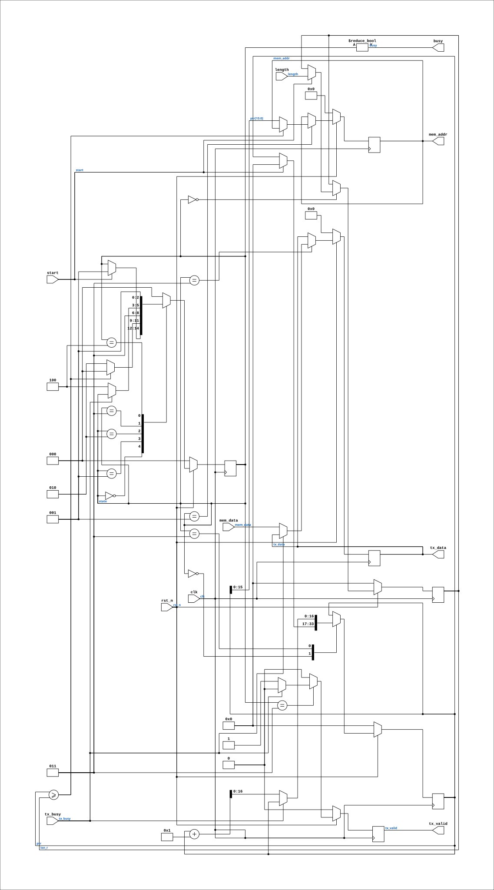

# buf_text_printer

Source: `Verilog/fpga/tang-nano-20k/sd-fat-test/src/buf_text_printer.v`

<!-- Generated by Verilog/tests/module_doc.py from the //! comments in the source. Do not edit by hand - edit the RTL comments and regenerate. -->

<!-- HIERARCHY-NAV:BEGIN - written by Verilog/tests/gen_hierarchy.py, do not edit -->

**Hierarchy:** not instantiated by any of the 9 build tops (elaborated by yosys).

[Module hierarchy](../../../../../HIERARCHY.md) - [All modules](../../../../../MODULES.md)

<!-- HIERARCHY-NAV:END -->


<!-- SCHEMATIC:BEGIN - written by Verilog/tests/gen_schematics.py, do not edit -->

## Schematic

Drawn from the Verilog: no build top uses this module, so it was elaborated from its own file with no defines and default parameters. Sub-modules are boxes (click the picture to open it full size; there every sub-module box links to its page, and every wire shows its Verilog name).

[](buf_text_printer.svg)

<!-- SCHEMATIC:END -->

## Description

Raw text printer for the SD-FAT test
Streams length bytes from the byte buffer (BRAM read port, 1-cycle
read latency) verbatim to the shared uart_tx. Used by the LIST menu
command: the directory-name packer has already stored the file names
with CR LF terminators, so no formatting is needed here.
Last reviewed: 10-JUL-2026
Ronny Hansen

## Parameters

| Parameter | Default |
|---|---|
| `ADDR_W` | `16` |

## Ports

| Direction | Width | Name | Description |
|---|---|---|---|
| input | `1` | `clk` |  |
| input | `1` | `rst_n` *(active low)* |  |
| input | `1` | `start` | 1-cycle pulse; only when busy=0 |
| input | `[ADDR_W:0]` | `length` | number of bytes to print (may be 0) |
| output | `1` | `busy` |  |
| output | `[ADDR_W-1:0]` | `mem_addr` |  |
| input | `[7:0]` | `mem_data` |  |
| output | `[7:0]` | `tx_data` |  |
| output | `1` | `tx_valid` |  |
| input | `1` | `tx_busy` |  |

## Verilog source

[`Verilog/fpga/tang-nano-20k/sd-fat-test/src/buf_text_printer.v`](https://github.com/RetroCoreLabs/nd-120/blob/main/Verilog/fpga/tang-nano-20k/sd-fat-test/src/buf_text_printer.v) on GitHub.

<details markdown="1">
<summary>Show the Verilog of buf_text_printer (86 lines)</summary>

```verilog
/****************************************************************************
** Raw text printer for the SD-FAT test                                    **
**                                                                         **
** Streams length bytes from the byte buffer (BRAM read port, 1-cycle      **
** read latency) verbatim to the shared uart_tx. Used by the LIST menu     **
** command: the directory-name packer has already stored the file names    **
** with CR LF terminators, so no formatting is needed here.                **
**                                                                         **
** Last reviewed: 10-JUL-2026                                              **
** Ronny Hansen                                                            **
*****************************************************************************/

module buf_text_printer #(
    parameter ADDR_W = 16
) (
    input clk,
    input rst_n,

    input             start,   // 1-cycle pulse; only when busy=0
    input [ADDR_W:0]  length,  // number of bytes to print (may be 0)
    output            busy,

    // buffer read port (registered BRAM: data valid 1 clk after addr)
    output reg [ADDR_W-1:0] mem_addr,
    input      [7:0]        mem_data,

    // handshake to the shared uart_tx
    output reg [7:0] tx_data,
    output reg       tx_valid,
    input            tx_busy
);

  localparam T_IDLE = 3'd0;
  localparam T_SET  = 3'd1;
  localparam T_WAIT = 3'd2;
  localparam T_SEND = 3'd3;
  localparam T_GAP  = 3'd4;

  reg [2:0] state;
  reg [ADDR_W:0] len_r, ptr;

  assign busy = (state != T_IDLE);

  always @(posedge clk) begin
    if (!rst_n) begin
      state    <= T_IDLE;
      len_r    <= 0;
      ptr      <= 0;
      mem_addr <= 0;
      tx_data  <= 0;
      tx_valid <= 1'b0;
    end else begin
      tx_valid <= 1'b0;
      case (state)
        T_IDLE:
        if (start) begin
          len_r <= length;
          ptr   <= 0;
          state <= T_SET;
        end

        T_SET:
        if (ptr >= len_r) state <= T_IDLE;
        else begin
          mem_addr <= ptr[ADDR_W-1:0];
          state    <= T_WAIT;
        end

        T_WAIT: state <= T_SEND;

        T_SEND:
        if (!tx_busy) begin
          tx_data  <= mem_data;
          tx_valid <= 1'b1;
          ptr      <= ptr + 1;
          state    <= T_GAP;
        end

        T_GAP: state <= T_SET;

        default: state <= T_IDLE;
      endcase
    end
  end

endmodule
```

</details>
