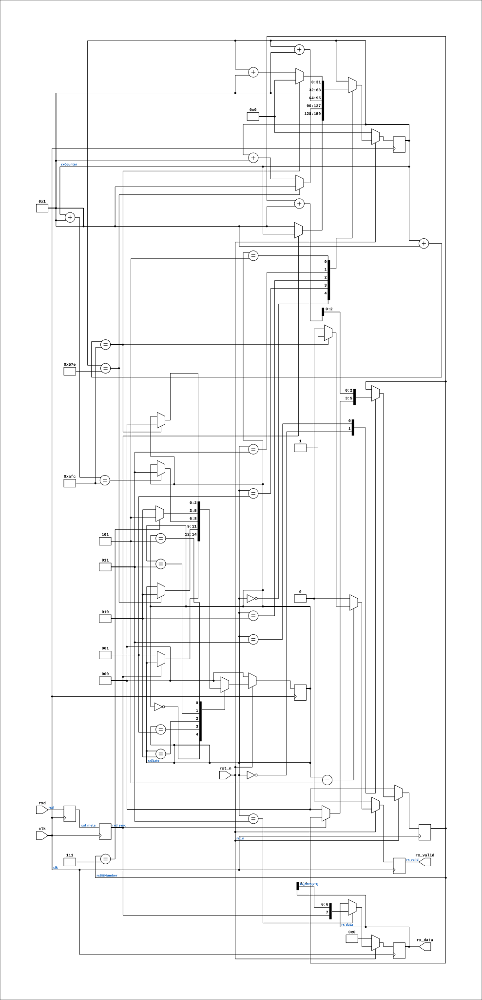

# uart_rx

Source: `Verilog/fpga/tang-nano-20k/sd-fat-test/src/uart_rx.v`

<!-- Generated by Verilog/tests/module_doc.py from the //! comments in the source. Do not edit by hand - edit the RTL comments and regenerate. -->

<!-- HIERARCHY-NAV:BEGIN - written by Verilog/tests/gen_hierarchy.py, do not edit -->

**Hierarchy:** not instantiated by any of the 9 build tops (elaborated by yosys).

[Module hierarchy](../../../../../HIERARCHY.md) - [All modules](../../../../../MODULES.md)

<!-- HIERARCHY-NAV:END -->


<!-- SCHEMATIC:BEGIN - written by Verilog/tests/gen_schematics.py, do not edit -->

## Schematic

Drawn from the Verilog: no build top uses this module, so it was elaborated from its own file with no defines and default parameters. Sub-modules are boxes (click the picture to open it full size; there every sub-module box links to its page, and every wire shows its Verilog name).

[](uart_rx.svg)

<!-- SCHEMATIC:END -->

## Description

UART receiver (8N1)
RX state machine borrowed from the ND-120 SC2661 EPCI model
(Verilog/Shared/support/SC2661_UART.v), with the EPCI register
interface stripped away. Half-bit start alignment, mid-bit sampling.
Last reviewed: 8-JUL-2026
Ronny Hansen

## Parameters

| Parameter | Default |
|---|---|
| `DELAY_FRAMES` | `2812` |

## Ports

| Direction | Width | Name | Description |
|---|---|---|---|
| input | `1` | `clk` |  |
| input | `1` | `rst_n` *(active low)* |  |
| input | `1` | `rxd` |  |
| output | `[7:0]` | `rx_data` | received byte, valid while rx_valid is high |
| output | `1` | `rx_valid` | 1-cycle pulse per received byte |

## Verilog source

[`Verilog/fpga/tang-nano-20k/sd-fat-test/src/uart_rx.v`](https://github.com/RetroCoreLabs/nd-120/blob/main/Verilog/fpga/tang-nano-20k/sd-fat-test/src/uart_rx.v) on GitHub.

<details markdown="1">
<summary>Show the Verilog of uart_rx (96 lines)</summary>

```verilog
/****************************************************************************
** UART receiver (8N1)                                                     **
**                                                                         **
** RX state machine borrowed from the ND-120 SC2661 EPCI model             **
** (Verilog/Shared/support/SC2661_UART.v), with the EPCI register          **
** interface stripped away. Half-bit start alignment, mid-bit sampling.    **
**                                                                         **
** Last reviewed: 8-JUL-2026                                               **
** Ronny Hansen                                                            **
*****************************************************************************/

module uart_rx #(
    // Clock cycles per bit. 27 MHz / 9600 baud = 2812 (-0.02% error)
    parameter DELAY_FRAMES = 2812
) (
    input clk,
    input rst_n,

    input rxd,

    output reg [7:0] rx_data,  // received byte, valid while rx_valid is high
    output reg       rx_valid  // 1-cycle pulse per received byte
);

  localparam HALF_DELAY_WAIT = (DELAY_FRAMES >> 1);

  localparam RX_STATE_IDLE      = 3'b000;
  localparam RX_STATE_START_BIT = 3'b001;
  localparam RX_STATE_READ_WAIT = 3'b010;
  localparam RX_STATE_READ      = 3'b011;
  localparam RX_STATE_STOP_BIT  = 3'b101;

  // Two-stage synchronizer - rxd is asynchronous to clk
  reg rxd_meta, rxd_sync;
  always @(posedge clk) begin
    rxd_meta <= rxd;
    rxd_sync <= rxd_meta;
  end

  reg [ 2:0] rxState;
  reg [31:0] rxCounter;
  reg [ 2:0] rxBitNumber;

  always @(posedge clk) begin
    if (!rst_n) begin
      rxState     <= RX_STATE_IDLE;
      rxCounter   <= 0;
      rxBitNumber <= 0;
      rx_data     <= 8'b0;
      rx_valid    <= 1'b0;
    end else begin
      rx_valid <= 1'b0;
      case (rxState)
        RX_STATE_IDLE: begin
          if (rxd_sync == 1'b0) begin  // start bit edge
            rxState     <= RX_STATE_START_BIT;
            rxCounter   <= 1;
            rxBitNumber <= 0;
          end
        end
        RX_STATE_START_BIT: begin
          if (rxCounter == HALF_DELAY_WAIT) begin
            rxState   <= RX_STATE_READ_WAIT;
            rxCounter <= 1;
          end else rxCounter <= rxCounter + 1;
        end
        RX_STATE_READ_WAIT: begin
          rxCounter <= rxCounter + 1;
          if ((rxCounter + 1) == DELAY_FRAMES) begin
            rxState <= RX_STATE_READ;
          end
        end
        RX_STATE_READ: begin
          rxCounter <= 1;
          rx_data   <= {rxd_sync, rx_data[7:1]};  // shift in, LSB first
          rxBitNumber <= rxBitNumber + 1;
          if (rxBitNumber == 3'b111) begin
            rxState <= RX_STATE_STOP_BIT;
          end else begin
            rxState <= RX_STATE_READ_WAIT;
          end
        end
        RX_STATE_STOP_BIT: begin
          rxCounter <= rxCounter + 1;
          if ((rxCounter + 1) == DELAY_FRAMES) begin
            rxState   <= RX_STATE_IDLE;
            rxCounter <= 0;
            rx_valid  <= 1'b1;
          end
        end
        default: rxState <= RX_STATE_IDLE;
      endcase
    end
  end

endmodule
```

</details>
