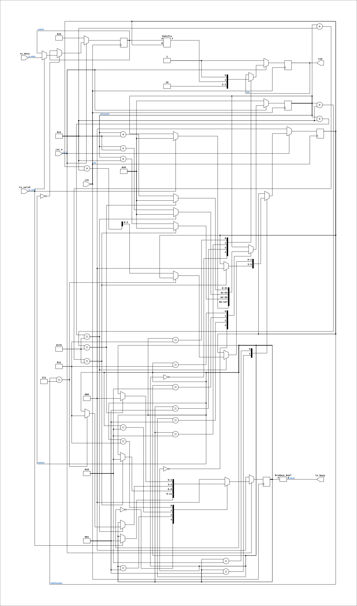

# uart_tx

Source: `Verilog/fpga/tang-nano-20k/sdram-test/src/uart_tx.v`

<!-- Generated by Verilog/tests/module_doc.py from the //! comments in the source. Do not edit by hand - edit the RTL comments and regenerate. -->

<!-- HIERARCHY-NAV:BEGIN - written by Verilog/tests/gen_hierarchy.py, do not edit -->

**Where it sits** (Tang): [ND120_TANG20K_TOP](../../../src/doc/ND120_TANG20K_TOP.md) > **uart_tx**
- instance path: `u_dbg_tx`

**Used in:** [ND120_TANG20K_TOP](../../../src/doc/ND120_TANG20K_TOP.md) (Tang)

**Contains:** no other modules.

[Module hierarchy](../../../../../HIERARCHY.md) - [All modules](../../../../../MODULES.md)

<!-- HIERARCHY-NAV:END -->


<!-- SCHEMATIC:BEGIN - written by Verilog/tests/gen_schematics.py, do not edit -->

## Schematic

Drawn from the Verilog: the yosys netlist of the Tang Nano 20K build, instance `u_dbg_tx`. Sub-modules are boxes (click the picture to open it full size; there every sub-module box links to its page, and every wire shows its Verilog name).

[](uart_tx.svg)

<!-- SCHEMATIC:END -->

## Description

UART transmitter (8N1)
TX state machine borrowed from the ND-120 SC2661 EPCI model
(Verilog/Shared/support/SC2661_UART.v), with the EPCI register
interface stripped away. Same states, same bit timing.
Last reviewed: 8-JUL-2026
Ronny Hansen

## Parameters

| Parameter | Default |
|---|---|
| `DELAY_FRAMES` | `234` |

## Ports

| Direction | Width | Name | Description |
|---|---|---|---|
| input | `1` | `clk` | 2x clk_cpu, same PLL, edge-aligned (same net as ND120_CORE.clk2x) |
| input | `1` | `rst_n` *(active low)* | Active-low reset, from the board's power-on reset (same net as ND120_CORE.sys_rst_n) |
| input | `[7:0]` | `tx_data` | byte to transmit |
| input | `1` | `tx_valid` | 1-cycle pulse: latch tx_data and start (only when tx_busy=0) |
| output | `1` | `tx_busy` | high while a frame is being shifted out |
| output | `1` | `txd` |  |

## Verilog source

[`Verilog/fpga/tang-nano-20k/sdram-test/src/uart_tx.v`](https://github.com/RetroCoreLabs/nd-120/blob/main/Verilog/fpga/tang-nano-20k/sdram-test/src/uart_tx.v) on GitHub.

<details markdown="1">
<summary>Show the Verilog of uart_tx (86 lines)</summary>

```verilog
/****************************************************************************
** UART transmitter (8N1)                                                  **
**                                                                         **
** TX state machine borrowed from the ND-120 SC2661 EPCI model             **
** (Verilog/Shared/support/SC2661_UART.v), with the EPCI register          **
** interface stripped away. Same states, same bit timing.                  **
**                                                                         **
** Last reviewed: 8-JUL-2026                                               **
** Ronny Hansen                                                            **
*****************************************************************************/

module uart_tx #(
    // Clock cycles per bit. 27 MHz / 115200 baud = 234 (-0.16% error)
    parameter DELAY_FRAMES = 234
) (
    input clk,             //! 2x clk_cpu, same PLL, edge-aligned (same net as ND120_CORE.clk2x)
    input rst_n,           //! Active-low reset, from the board's power-on reset (same net as ND120_CORE.sys_rst_n)

    input [7:0] tx_data,   // byte to transmit
    input       tx_valid,  // 1-cycle pulse: latch tx_data and start (only when tx_busy=0)
    output      tx_busy,   // high while a frame is being shifted out

    output reg txd
);

  localparam TX_STATE_IDLE      = 3'b000;
  localparam TX_STATE_START_BIT = 3'b001;
  localparam TX_STATE_WRITE     = 3'b010;
  localparam TX_STATE_STOP_BIT  = 3'b011;

  reg [ 2:0] txState;
  reg [31:0] txCounter;
  reg [ 2:0] txBitNumber;
  reg [ 7:0] txShift;

  assign tx_busy = (txState != TX_STATE_IDLE);

  always @(posedge clk) begin
    if (!rst_n) begin
      txState     <= TX_STATE_IDLE;
      txd         <= 1'b1;  // line idles at MARK
      txCounter   <= 0;
      txBitNumber <= 0;
      txShift     <= 8'b0;
    end else begin
      case (txState)
        TX_STATE_IDLE: begin
          txd <= 1'b1;
          if (tx_valid) begin
            txShift   <= tx_data;
            txCounter <= 0;
            txState   <= TX_STATE_START_BIT;
          end
        end
        TX_STATE_START_BIT: begin
          txd <= 1'b0;
          if ((txCounter + 1) == DELAY_FRAMES) begin
            txState     <= TX_STATE_WRITE;
            txBitNumber <= 0;
            txCounter   <= 0;
          end else txCounter <= txCounter + 1;
        end
        TX_STATE_WRITE: begin
          txd <= txShift[txBitNumber];  // LSB first
          if ((txCounter + 1) == DELAY_FRAMES) begin
            if (txBitNumber == 3'b111) begin
              txState <= TX_STATE_STOP_BIT;
            end else begin
              txBitNumber <= txBitNumber + 1;
            end
            txCounter <= 0;
          end else txCounter <= txCounter + 1;
        end
        TX_STATE_STOP_BIT: begin
          txd <= 1'b1;
          if ((txCounter + 1) == DELAY_FRAMES) begin
            txState   <= TX_STATE_IDLE;
            txCounter <= 0;
          end else txCounter <= txCounter + 1;
        end
        default: txState <= TX_STATE_IDLE;
      endcase
    end
  end

endmodule
```

</details>
